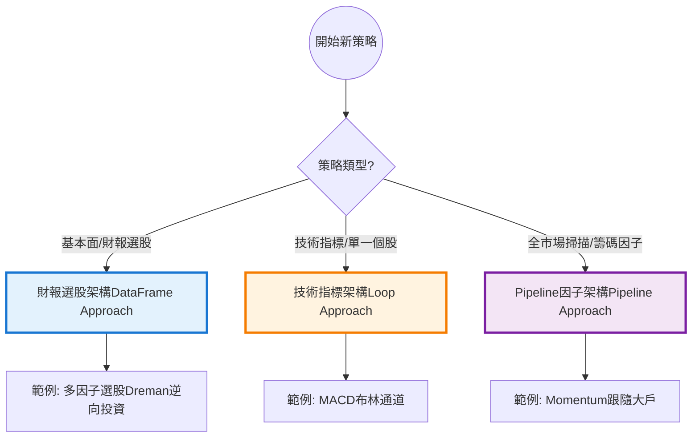
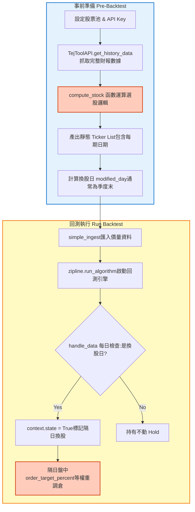
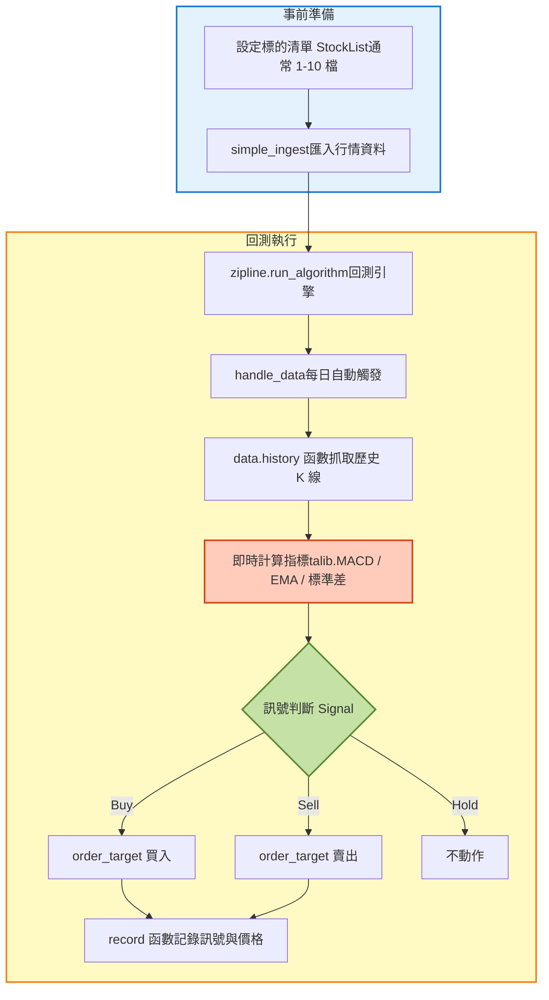
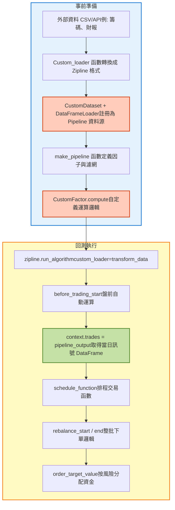
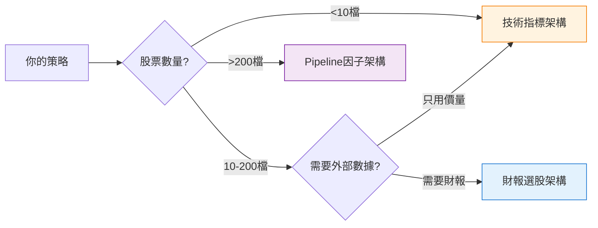

# 量化開發三大架構概覽 (Framework Overview)

本頁面提供三大架構的高階資料流向圖。請依據你的策略屬性選擇最適合的路線。

---

## 🗺️ 決策路徑圖

---

## 📊 架構性能對比表

| 特性 | 財報選股架構 | 技術指標架構 | Pipeline因子架構 |
| :--- | :---: | :---: | :---: |
| **適用股票數** | 50-200檔 | 1-10檔 | 500-2000檔 |
| **運算速度** | 🟢 快 | 🟡 中 | 🟢 快 |
| **開發難度** | 🟢 易 | 🟢 易 | 🔴 難 |
| **彈性** | 🟡 中 | 🟢 高 | 🔴 低 |
| **記憶體需求** | 🟢 低 | 🟢 低 | 🔴 高 |
| **典型調倉頻率** | 季度/月度 | 每日 | 每日/每月 |

---

## 🏗️ 架構 A：財報選股架構 (DataFrame Approach)

**核心概念：** 先在 Python/DataFrame 把名單算好，回測只是「照表操課」。  
**關鍵函數：** `compute_stock(date, data)`

**📌 關鍵特徵：**

- ✅ 避免前視偏差：使用 `context.state` 延遲到隔日下單
- ✅ 數據透明：所有篩選邏輯都在 `compute_stock()` 中
- ❌ 不適合高頻：重新運算成本高

---

## ⚡ 架構 B：技術指標架構 (Loop Approach)

**核心概念：** 在回測的每一天，即時抓過去 K 線來算指標。  
**關鍵函數：** `handle_data(context, data)`

**📌 關鍵特徵：**

- ✅ 簡單直觀：邏輯與傳統回測一致
- ✅ 彈性高：可隨時調整參數
- ❌ 效能瓶頸：大量股票會很慢（需要 loop）

---

## 🚀 架構 C：Pipeline 因子架構 (Pipeline Approach)

**核心概念：** 使用 Zipline 核心引擎，處理全市場大規模運算最快。  
**關鍵函數：** `make_pipeline()`, `before_trading_start()`

**📌 關鍵特徵：**

- ✅ 極致效能：全市場 2000 檔股票也能秒算
- ✅ 避免前視偏差：Pipeline 引擎自動處理
- ❌ 學習曲線陡峭：需理解 CustomFactor、DataFrameLoader
- ❌ Debug 困難：錯誤訊息不直觀

---

## 💡 如何選擇？快速檢查表

**👉 Next Step:**  
前往對應架構的詳細頁面，複製 Code Template 開始開發！