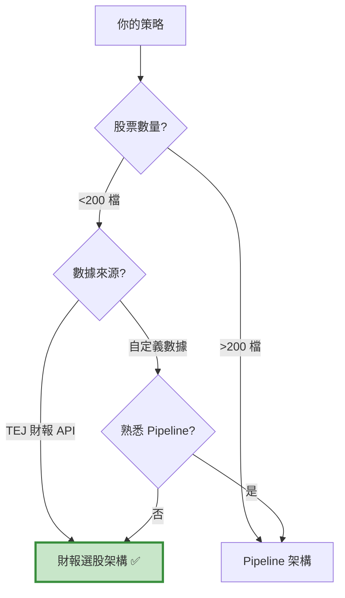

# 財報選股架構 - 常見問題 FAQ

本頁整理使用財報選股架構時最常遇到的問題與解決方案。

---

## 📑 目錄

- [基礎概念](#basics)          
- [數據處理](#data-process)     
- [選股邏輯](#logic)            
- [回測設定](#backtest)         
- [除錯技巧](#debug)            
- [效能優化](#optimize)         
- [實務應用](#practice)

---

## 基礎概念 {: #basics }

### Q1: 財報選股架構 vs Pipeline 架構，我該選哪個？

**決策樹：**


**快速判斷：**

- ✅ 用財報選股：資料來自 TEJ API、調倉頻率季/月、股票數 <200
- ✅ 用 Pipeline：全市場掃描、自定義因子、需要極致效能

---

### Q2: 為什麼要「事前計算 + 事後執行」分離？

**原因 1：避免前視偏差**
```python
# ❌ 錯誤：回測時看到當天財報就下單
if date == '2023-03-31':
    tickers = compute_stock('2023-03-31')  # 用 3/31 財報
    for t in tickers:
        order(t, 100)  # 3/31 當天就下單！

# ✅ 正確：看到財報後，隔天才下單
if date == '2023-03-31':
    context.order_tickers = compute_stock('2023-03-31')
    context.state = True  # 標記明天執行

if context.state == True:  # 4/1 才下單
    for t in context.order_tickers:
        order(t, 100)
```

**原因 2：方便檢查**
```python
# 在回測外先測試選股函數
test_tickers = compute_stock('2023-03-31', data__)
print(f"入選股票: {test_tickers}")  # 確認邏輯正確再回測
```

**原因 3：效能考量**
```python
# 一次算完所有日期，比在回測內重複計算快很多
all_results = {date: compute_stock(date, data__) for date in modified_day}
```

---

### Q3: 什麼時候用交集法 / 計分法 / 排名法？

| 方法 | 適用情境 | 優點 | 缺點 |
| :--- | :--- | :--- | :--- |
| **交集法** | 條件明確（3-5 個） | 邏輯清晰、易理解 | 條件太嚴可能選不到股票 |
| **計分法** | 條件很多（>5 個） | 靈活、容錯性高 | 權重難以調整 |
| **排名法** | 通過者太多（>30 檔） | 自動篩選最優 | 需要有排序指標 |

**實務建議：**
```python
# Step 1: 先用交集法測試
tickers = list(set_1 & set_2 & set_3)

# Step 2: 如果選太多，改用排名法
if len(tickers) > 30:
    df_filtered = df[df['股票代碼'].isin(tickers)]
    top_20 = df_filtered.nsmallest(20, 'PEG')
    tickers = list(top_20['股票代碼'])

# Step 3: 如果選太少，改用計分法
if len(tickers) < 5:
    # 降低標準，允許某些條件不符
    tickers = compute_with_scoring(min_score=2)
```

---

## 數據處理 {: #data-process }

### Q4: 為什麼我抓到的數據是空的？

**常見原因與解決方案：**

#### 原因 1: 日期格式錯誤
```python
# ❌ 錯誤
data = TejToolAPI.get_history_data(
    start='2023-01-01',  # 字串格式
    end='2023-12-31',
    ...
)

# ✅ 正確
data = TejToolAPI.get_history_data(
    start=pd.Timestamp('2023-01-01', tz='UTC'),  # Timestamp 格式
    end=pd.Timestamp('2023-12-31', tz='UTC'),
    ...
)
```

#### 原因 2: 股票池為空
```python
# 檢查股票池
pool = get_universe(...)
print(f"股票池: {len(pool)} 檔")  # 應該 > 0
print(f"範例: {pool[:5]}")

# 如果為空，檢查篩選條件
pool = get_universe(
    start=...,
    end=...,
    mkt_bd_e=['TSE', 'OTC'],  # 確認市場別正確
    stktp_e='Common Stock'     # 確認股票類型正確
)
```

#### 原因 3: 欄位名稱錯誤
```python
# ❌ 錯誤：欄位名不存在
columns = ['mktcap', 'PE', 'ROE']  # 'PE' 應該是 'per'

# ✅ 正確：參考 TEJ 文檔
columns = ['mktcap', 'per', 'r103']  # ROE 是 r103

# 💡 小技巧：先用 transfer_to_chinese=True 確認欄位
data = TejToolAPI.get_history_data(
    ...,
    transfer_to_chinese=True
)
print(data.columns)  # 查看所有可用欄位
```

---

### Q5: 財報數據的時間點怎麼處理？

**關鍵概念：財報公告延遲**
```python
# 例如：2023 Q1 財報（1-3 月）
# - 會計期間結束：2023-03-31
# - 實際公告日：2023-05-15（延遲 45 天）
# - 可使用日期：2023-05-16 之後

# 解決方案 1：使用 TEJ 的 include_self_acc='Y'
data = TejToolAPI.get_history_data(
    ...,
    include_self_acc='Y'  # 包含自結數（提前 30 天）
)

# 解決方案 2：手動延遲
def compute_stock(date, data, delay_days=45):
    # 使用 45 天前的財報
    data_date = date - pd.Timedelta(days=delay_days)
    df = data[data['日期'] == data_date]
    ...
```

**最佳實務：**
```python
# 用季報資料，並設定合理延遲
data = TejToolAPI.get_history_data(
    fin_type='Q',  # 季報
    include_self_acc='Y'  # 包含自結
)

# 換股日設在每季後 2 個月（安全邊際）
rebalance_months = [5, 8, 11, 2]  # Q1→5月, Q2→8月, Q3→11月, Q4→2月
```

---

### Q6: 如何處理缺失值（NaN）？
```python
def compute_stock(date, data):
    df = data[data['日期'] == date].reset_index(drop=True)
    
    # 方法 1: 直接排除缺失值
    df = df.dropna(subset=['本益比', 'ROE'])
    
    # 方法 2: 只對有效值計算平均
    avg_per = df['本益比'].mean(skipna=True)  # skipna=True 忽略 NaN
    
    # 方法 3: 填補缺失值
    df['ROE'].fillna(0, inplace=True)  # 用 0 填補
    
    # 方法 4: 檢查再篩選（最嚴謹）
    valid_df = df[
        (df['本益比'].notna()) &    # 本益比不是 NaN
        (df['本益比'] > 0) &         # 且 > 0
        (df['本益比'] < 100)         # 且 < 100（排除極端值）
    ]
    
    return list(valid_df['股票代碼'])
```

**推薦做法：**
```python
# 先清理數據，再計算條件
df = df[
    (df['本益比'].notna()) & 
    (df['本益比'] > 0) & 
    (df['本益比'] < 100)
].copy()

# 這樣後續計算不會出錯
avg_per = df['本益比'].mean()
set_1 = set(df[df['本益比'] < avg_per]['股票代碼'])
```

---

### Q7: 產業平均值計算有問題？

**常見錯誤：**
```python
# ❌ 錯誤：產業別欄位是 NaN
df['產業平均本益比'] = df.groupby('主產業別_中文')['本益比'].transform('mean')
# 如果某些股票沒有產業別，groupby 會出錯

# ✅ 正確：先處理缺失值
df['主產業別_中文'].fillna('其他', inplace=True)
df['產業平均本益比'] = df.groupby('主產業別_中文')['本益比'].transform('mean')
```

**Debug 技巧：**
```python
# 檢查產業分佈
print(df['主產業別_中文'].value_counts())

# 檢查每個產業的平均值
industry_avg = df.groupby('主產業別_中文')['本益比'].mean()
print(industry_avg)

# 檢查是否有產業只有 1 檔股票
small_industries = industry_avg[industry_avg.index.isin(
    df['主產業別_中文'].value_counts()[df['主產業別_中文'].value_counts() < 3].index
)]
print(f"小產業（<3 檔）: {small_industries}")
```

---

## 選股邏輯 {: #logic }

### Q8: 為什麼我選不到任何股票？

**診斷步驟：**
```python
def compute_stock_debug(date, data):
    df = data[data['日期'] == pd.Timestamp(date)].reset_index(drop=True)
    
    print(f"\n========== Debug {date} ==========")
    print(f"總股票數: {len(df)}")
    
    # 逐條件檢查
    set_1 = set(df[df['本益比'] < df['本益比'].mean()]['股票代碼'])
    print(f"條件 1 通過: {len(set_1)} 檔")
    
    set_2 = set(df[df['流動比率'] > 1.0]['股票代碼'])
    print(f"條件 2 通過: {len(set_2)} 檔")
    
    set_3 = set(df[df['負債比'] < 0.5]['股票代碼'])
    print(f"條件 3 通過: {len(set_3)} 檔")
    
    # 逐步取交集
    temp = set_1 & set_2
    print(f"條件 1 & 2: {len(temp)} 檔")
    
    final = temp & set_3
    print(f"條件 1 & 2 & 3: {len(final)} 檔")
    
    if len(final) == 0:
        print("⚠️ 警告：無股票通過所有條件")
        print("建議：放寬某些條件或改用計分法")
    
    return list(final)
```

**常見解決方案：**

1. **條件太嚴格 → 放寬**
```python
# 原本：負債比 < 20%
set_3 = set(df[df['負債比'] < 0.2]['股票代碼'])

# 放寬：負債比 < 50%
set_3 = set(df[df['負債比'] < 0.5]['股票代碼'])
```

2. **交集法 → 計分法**
```python
# 至少滿足 3 個條件即可
score = (
    (ticker in set_1).astype(int) +
    (ticker in set_2).astype(int) +
    (ticker in set_3).astype(int)
)
selected = df[score >= 3]['股票代碼'].tolist()
```

3. **使用動態門檻**
```python
# 根據市況調整
if market_condition == 'bull':
    min_score = 4  # 牛市嚴格
else:
    min_score = 2  # 熊市寬鬆
```

---

### Q9: 如何設計合理的選股條件？

**SMART 原則：**

- **S** pecific（具體）：「ROE 高」→「ROE > 15%」
- **M** easurable（可量化）：避免主觀條件
- **A** chievable（可達成）：不要太嚴格（如 ROE > 50%）
- **R** elevant（相關）：條件要對報酬有解釋力
- **T** ime-bound（有時效）：考慮財報延遲

**建議流程：**
```python
# Step 1: 單變量測試（每個條件獨立測試）
for condition in [條件1, 條件2, 條件3]:
    backtest_single_condition(condition)
    # 看哪些條件有效

# Step 2: 雙變量測試（兩兩組合）
for c1, c2 in combinations([條件1, 條件2, 條件3], 2):
    backtest_two_conditions(c1, c2)
    # 找出協同效應

# Step 3: 多變量測試（全部組合）
backtest_all_conditions()
```

**經驗法則：**

- 估值因子（本益比、股價淨值比）：必備
- 品質因子（ROE、毛利率）：建議有
- 成長因子（營收成長、EPS 成長）：加分項
- 動能因子（股價趨勢）：可選

---

### Q10: 條件之間有衝突怎麼辦？

**常見衝突：**
```python
# 衝突 1: 低本益比 vs 高成長
# 低本益比公司通常成長慢
# 高成長公司通常本益比高

# 解決：用 PEG（本益比 / 成長率）平衡
df['PEG'] = df['本益比'] / df['盈餘成長率']
set_balanced = set(df[df['PEG'] < 1.0]['股票代碼'])

# 衝突 2: 高股息 vs 高成長
# 高股息公司通常是成熟期
# 高成長公司通常不配息

# 解決：分成兩個策略
strategy_dividend = select_high_dividend_stocks()
strategy_growth = select_high_growth_stocks()
final_tickers = strategy_dividend + strategy_growth
```

**優先級設計：**
```python
# 方法 1: 核心條件 + 可選條件
core = set_1 & set_2  # 必須通過
optional = set_3 | set_4  # 至少通過一個
final = core & optional

# 方法 2: 加權計分
score = (
    (ticker in set_1) * 3 +  # 最重要
    (ticker in set_2) * 2 +  # 次重要
    (ticker in set_3) * 1    # 加分項
)
```

---

## 回測設定 {: #backtest }

### Q11: 日期對不上，換股日沒有觸發？

**診斷步驟：**
```python
# Step 1: 檢查換股日是否為交易日
print("換股日:", modified_day[:5])
print("回測日期範圍:", start_date, "~", end_date)

# Step 2: 在 handle_data 中加入 debug
def handle_data(context, data):
    backtest_date = data.current_dt.date()
    
    # 每次都印出來檢查
    if context.i < 10 or backtest_date in modified_day:
        print(f"Day {context.i}: {backtest_date}, 是換股日: {backtest_date in modified_day}")
    
    # 原本的邏輯...
```

**常見問題：**

#### 問題 1: 日期格式不一致
```python
# ❌ 錯誤
modified_day = [pd.Timestamp('2023-03-31')]  # Timestamp
backtest_date = data.current_dt.date()        # date

if backtest_date in modified_day:  # 永遠 False！

# ✅ 正確
modified_day = [pd.Timestamp('2023-03-31').date()]  # 統一用 date
```

#### 問題 2: 非交易日
```python
# 例如 2023-03-31 是星期五，但當天休市
# 實際交易日是 2023-04-03

# 解決：用 TEJ 交易日曆
trade_days = tejapi.get('TWN/TRADEDAY_TWSE', ...)
```

#### 問題 3: 時區問題
```python
# ❌ 錯誤
modified_day = [pd.Timestamp('2023-03-31')]  # 沒有 tz

# ✅ 正確
modified_day = [pd.Timestamp('2023-03-31', tz='UTC').date()]
```

---

### Q12: 為什麼回測結果跟預期差很多？

**檢查清單：**

#### 1. 交易成本設定
```python
# 是否設定手續費和滑價？
set_commission(commission.Custom_TW_Commission(
    min_trade_cost=20,
    discount=0.6,  # 檢查折扣是否合理
    tax=0.003
))

set_slippage(slippage.VolumeShareSlippage(
    volume_limit=0.25,  # 檢查是否太樂觀
    price_impact=0.01
))
```

#### 2. 前視偏差
```python
# ❌ 當天選股當天下單
if date in modified_day:
    tickers = compute_stock(date)
    for t in tickers:
        order(t, 100)  # 錯誤！

# ✅ 當天選股隔天下單
if date in modified_day:
    context.order_tickers = compute_stock(date)
    context.state = True

if context.state:
    for t in context.order_tickers:
        order(t, 100)
    context.state = False
```

#### 3. 倖存者偏差
```python
# get_universe 會自動處理下市股票
pool = get_universe(
    start=start_date,
    end=end_date,
    ...
)
# pool 只包含在該期間有交易的股票
# 下市股票會在下市前就被移除
```

#### 4. 數據品質
```python
# 檢查數據是否完整
print(f"數據筆數: {len(data__)}")
print(f"股票數 × 日期數: {len(pool)} × {len(modified_day)}")
print(f"預期筆數: {len(pool) * len(modified_day)}")

# 檢查是否有異常值
print(data__['本益比'].describe())
# 如果 max > 1000，可能有問題
```

---

### Q13: 如何設定合理的初始資金和持股數量？

**初始資金建議：**
```python
# 根據策略類型調整
strategies = {
    '多因子選股': {
        'capital_base': 1e7,      # 1000 萬（預期 15-25 檔）
        'min_position': 300000,   # 最低單一部位 30 萬
    },
    '小型成長股': {
        'capital_base': 5e6,      # 500 萬（預期 5-10 檔）
        'min_position': 500000,   # 最低單一部位 50 萬
    },
    'Dreman 逆向': {
        'capital_base': 2e7,      # 2000 萬（預期 10-20 檔）
        'min_position': 500000,   # 最低單一部位 50 萬
    }
}
```

**動態部位管理：**
```python
def handle_data(context, data):
    if context.state == True:
        # 計算目標部位
        num_stocks = len(context.order_tickers)
        
        # 確保單一部位不會太小
        min_position_value = 300000  # 30 萬
        max_stocks = context.portfolio.portfolio_value // min_position_value
        
        if num_stocks > max_stocks:
            # 股票太多，只買前 N 檔
            context.order_tickers = context.order_tickers[:max_stocks]
            num_stocks = max_stocks
        
        # 等權重配置
        weight = 1.0 / num_stocks
        for ticker in context.order_tickers:
            order_target_percent(symbol(ticker), weight)
```

---

## 除錯技巧 {: #debug }

### Q14: 如何快速找到問題？

**分層除錯法：**
```python
# Layer 1: 測試選股函數（不回測）
print("=== 測試選股函數 ===")
test_date = pd.Timestamp('2023-03-31').date()
tickers = compute_stock(test_date, data__, verbose=True)
print(f"入選: {tickers}")

# Layer 2: 測試單一日期回測
print("\n=== 測試單日回測 ===")
results = run_algorithm(
    start=pd.Timestamp('2023-03-31', tz='utc'),
    end=pd.Timestamp('2023-04-05', tz='utc'),  # 只跑 5 天
    ...
)

# Layer 3: 測試短期回測
print("\n=== 測試短期回測 ===")
results = run_algorithm(
    start=pd.Timestamp('2023-01-01', tz='utc'),
    end=pd.Timestamp('2023-03-31', tz='utc'),  # 只跑一季
    ...
)

# Layer 4: 完整回測
print("\n=== 完整回測 ===")
results = run_algorithm(
    start=pd.Timestamp('2019-01-01', tz='utc'),
    end=pd.Timestamp('2023-12-31', tz='utc'),
    ...
)
```

---

### Q15: 常見錯誤訊息及解決方法

#### 錯誤 1: `KeyError: 'XXX'`
```python
# 原因：欄位名稱錯誤
# 解決：
print(data__.columns)  # 檢查實際欄位名
```

#### 錯誤 2: `ValueError: cannot convert float NaN to integer`
```python
# 原因：數據有 NaN，無法轉整數
# 解決：
df['股數'] = df['股數'].fillna(0).astype(int)
```

#### 錯誤 3: `ZeroDivisionError: division by zero`
```python
# 原因：分母為 0
# 解決：
df['負債比'] = df.apply(
    lambda row: row['負債'] / row['淨值'] if row['淨值'] != 0 else np.nan,
    axis=1
)
```

#### 錯誤 4: `Equity(XXX) does not exist`
```python
# 原因：股票不在 bundle 中
# 解決：
# 1. 檢查 ingest 時是否包含該股票
# 2. 檢查日期範圍是否正確
pools = pool + ['IR0001']  # 確保基準指數也在內
simple_ingest(name='tquant', tickers=pools, ...)
```

---

## 效能優化 {: #optimize }

### Q16: 回測速度太慢怎麼辦？

**優化技巧：**

#### 1. 減少數據量
```python
# 只載入需要的欄位
columns = ['mktcap', 'per', 'roe']  # 不要用 ['*']

# 只載入需要的日期範圍
data = TejToolAPI.get_history_data(
    start=start_dt,
    end=end_dt,  # 不要抓太長
    ...
)
```

#### 2. 預先計算
```python
# 預先計算所有換股日的名單
print("預先計算選股名單...")
stock_lists = {}
for date in modified_day:
    stock_lists[date] = compute_stock(date, data__)
    print(f"{date}: {len(stock_lists[date])} 檔")

# 回測時直接查表
def handle_data(context, data):
    backtest_date = data.current_dt.date()
    if backtest_date in stock_lists:
        context.order_tickers = stock_lists[backtest_date]
        context.state = True
```

#### 3. 向量化運算
```python
# ❌ 慢：用迴圈
for ticker in df['股票代碼']:
    if ticker in set_1 and ticker in set_2:
        selected.append(ticker)

# ✅ 快：用向量化
mask = df['股票代碼'].isin(set_1) & df['股票代碼'].isin(set_2)
selected = df[mask]['股票代碼'].tolist()
```

---

### Q17: 記憶體不足怎麼辦？
```python
# 方法 1: 分批載入
chunk_size = 200
for i in range(0, len(pool), chunk_size):
    chunk_pool = pool[i:i+chunk_size]
    chunk_data = TejToolAPI.get_history_data(
        ticker=chunk_pool,
        ...
    )
    # 處理 chunk_data

# 方法 2: 只保留必要欄位
data = data[['coid', 'mdate', '本益比', 'ROE']]  # 刪除不用的欄位

# 方法 3: 轉換數據類型
data['本益比'] = data['本益比'].astype('float32')  # float64 → float32 省一半記憶體
```

---

## 實務應用 {: #practice }

### Q18: 如何把回測策略部署到實盤？

**步驟：**
```python
# Step 1: 建立選股排程腳本
# select_stocks.py
import schedule
import time

def daily_selection():
    today = pd.Timestamp.now().date()
    if today in modified_day:
        tickers = compute_stock(today, get_latest_data())
        save_to_file(tickers, f'portfolio_{today}.csv')
        send_notification(f"今日選股完成：{len(tickers)} 檔")

schedule.every().day.at("18:00").do(daily_selection)

while True:
    schedule.run_pending()
    time.sleep(60)

# Step 2: 建立下單腳本
# place_orders.py
def execute_orders():
    portfolio = pd.read_csv('portfolio_latest.csv')
    for ticker in portfolio['ticker']:
        # 透過券商 API 下單
        broker_api.order(ticker, quantity=...)
```

**注意事項：**

- ⚠️ 實盤交易前務必小額測試
- ⚠️ 設定停損機制
- ⚠️ 監控系統運作狀態
- ⚠️ 準備緊急熔斷機制

---

### Q19: 如何評估策略是否過度擬合？

**檢驗方法：**

#### 1. 樣本外測試
```python
# 訓練期：2015-2020
train_results = run_algorithm(
    start=pd.Timestamp('2015-01-01', tz='utc'),
    end=pd.Timestamp('2020-12-31', tz='utc'),
    ...
)

# 測試期：2021-2023
test_results = run_algorithm(
    start=pd.Timestamp('2021-01-01', tz='utc'),
    end=pd.Timestamp('2023-12-31', tz='utc'),
    ...
)

# 比較績效
print(f"訓練期年化報酬: {train_sharpe}")
print(f"測試期年化報酬: {test_sharpe}")

# 如果測試期明顯變差 → 過擬合
```

#### 2. 滾動窗口測試
```python
# 每年重新訓練
for year in range(2015, 2023):
    train_start = f"{year-3}-01-01"
    train_end = f"{year}-12-31"
    test_start = f"{year+1}-01-01"
    test_end = f"{year+1}-12-31"
    
    # 用過去 3 年訓練，測試下一年
    strategy = optimize_on(train_start, train_end)
    results = backtest_on(test_start, test_end, strategy)
```

#### 3. 參數敏感度分析
```python
# 測試參數變化對績效的影響
for threshold in [0.1, 0.15, 0.2, 0.25, 0.3]:
    results = backtest(debt_ratio_threshold=threshold)
    print(f"負債比門檻 {threshold}: 報酬 {results.annual_return}")

# 如果小幅調整參數就大幅影響績效 → 過擬合
```

---

### Q20: 策略績效不如預期，該怎麼改進？

**診斷流程：**
```python
# Step 1: 單因子測試
for factor in ['本益比', 'ROE', '負債比', '股息率']:
    sharpe = backtest_single_factor(factor)
    print(f"{factor} Sharpe: {sharpe}")

# Step 2: 相關性分析
import seaborn as sns
corr_matrix = returns_df.corr()
sns.heatmap(corr_matrix)
# 找出相關性低的因子組合

# Step 3: 歸因分析
from pyfolio import timeseries
timeseries.perf_stats(returns)
# 分析報酬來源：Beta? Alpha? 產業暴露?

# Step 4: 改進方向
improvements = {
    '選股太少': '放寬條件 / 改用計分法',
    '週轉率太高': '延長持有期 / 加入動量過濾',
    '回撤太大': '加入停損 / 分散產業',
    '無超額報酬': '重新設計因子 / 加入市場擇時'
}
```

---

## 💡 最佳實踐總結

### ✅ DO（建議做）

1. **先測試小範圍**：單日 → 單季 → 全期間
2. **用 verbose 模式**：詳細記錄選股過程
3. **檢查數據品質**：缺失值、極端值、異常值
4. **避免前視偏差**：使用 `context.state` 延遲下單
5. **設定合理交易成本**：手續費、滑價、稅
6. **樣本外測試**：訓練期 + 測試期分離
7. **定期檢查持倉**：用 `record()` 記錄關鍵變數
8. **文檔化參數**：記錄為什麼選這些條件

### ❌ DON'T（避免做）

1. **直接全期回測**：跳過除錯步驟
2. **忽略數據延遲**：用當季財報當季下單
3. **過度優化參數**：調到小數點第三位
4. **忽略交易成本**：假設零成本交易
5. **只看報酬率**：忽略風險、回撤、週轉率
6. **照抄別人策略**：不理解邏輯就使用
7. **過度擬合**：條件太多太細
8. **沒有容錯機制**：選不到股票就當機

---

## 🔗 相關資源

- **架構說明**：[index.md](index.md)
- **Code 模板**：[template.md](template.md)
- **案例學習**：
  - [多因子選股](case-multifactor.md)
  - [小型成長股](case-smallcap.md)
  - [Dreman 逆向投資](case-dreman.md)

---

**還有問題？**

如果這裡沒有涵蓋你的問題，請：

1. 檢查 [template.md](template.md) 的註解
2. 參考三個 case study 的實作
3. 回到 [overview.md](../overview.md) 確認是否選對架構

**👉 準備好了？** 前往 [template.md](template.md) 開始開發你的策略！