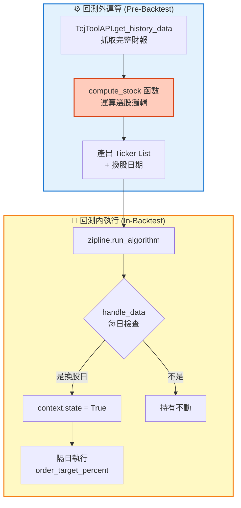
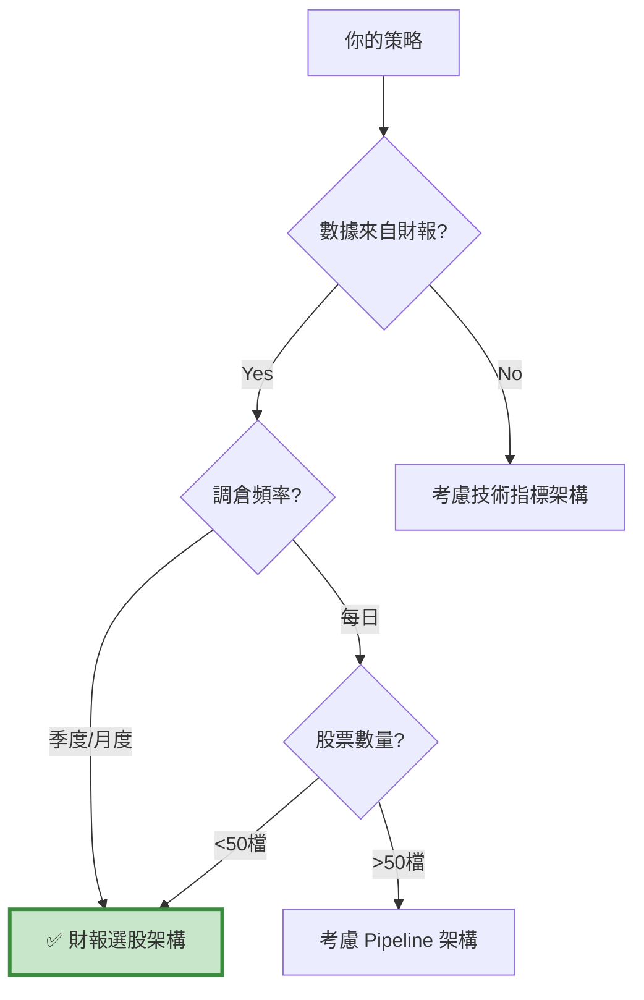

# 架構 A：財報選股架構 (Fundamental Selection Framework)

> **核心思想：先算出名單，回測只是執行。**  
> "Calculate the list first, backtest is just execution."

---

## 📌 核心概念

財報選股架構的本質是「**事前計算 + 事後執行**」的分離設計：
```
Step 1: 在回測外，用 DataFrame 算出每期的股票名單
Step 2: 在回測內，照表操課執行交易
```

這種架構最符合真實投資的思考邏輯：
- 📊 **月底**：打開財報資料庫，篩選出符合條件的股票
- 📅 **隔月初**：照著名單下單

---

## 🎯 適用場景

### ✅ 最適合的情境
- **基本面選股**：本益比、ROE、負債比等財報指標
- **季度調倉**：配合財報公告週期（3/6/9/12月）
- **多條件篩選**：需要同時檢查 5+ 個財務指標
- **中等規模股票池**：50-200 檔股票

### ❌ 不適合的情境
- ❌ 日內交易、高頻策略
- ❌ 純技術指標（MACD、KD 等）
- ❌ 需要即時運算的因子
- ❌ 超大規模市場掃描（>500 檔）

---

## 🏗️ 架構特色

### 數據流向圖


### 關鍵設計理念

#### 1. 避免前視偏差 (Look-ahead Bias)
```python
# ❌ 錯誤：當天看到訊號就下單
if date == rebalance_date:
    order_target_percent(symbol, weight)

# ✅ 正確：標記今天，隔天才下單
if date == rebalance_date:
    context.state = True  # 標記
    context.order_tickers = compute_stock(date)

if context.state == True:  # 隔天執行
    for ticker in context.order_tickers:
        order_target_percent(symbol(ticker), weight)
```

#### 2. 數據透明化
所有篩選邏輯都在 `compute_stock()` 函數中，方便檢查和調試：
```python
def compute_stock(date, data):
    df = data[data['日期'] == date]
    
    # 條件 1: 本益比 < 產業平均
    set_1 = set(df[df['本益比'] < df['產業平均本益比']]['股票代碼'])
    
    # 條件 2: 負債比 < 20%
    set_2 = set(df[df['負債比'] < 0.2]['股票代碼'])
    
    # 取交集
    return list(set_1 & set_2)
```

#### 3. 靈活的換股週期
```python
# 方法 1: 固定日期（每季最後一天）
modified_day = ['2023-03-31', '2023-06-30', '2023-09-30', '2023-12-31']

# 方法 2: 動態計算（TEJ 交易日曆）
trade_days = tejapi.get('TWN/TRADEDAY_TWSE', ...)
last_days = trade_days.groupby(['year', 'quarter'])['date'].max()
```

---

## 📊 與其他架構的差異

| 特性 | 財報選股架構 | 技術指標架構 | Pipeline 架構 |
| :--- | :---: | :---: | :---: |
| **運算時機** | 回測外 | 回測內（每日） | 回測內（盤前） |
| **數據來源** | TEJ 財報 API | Zipline 歷史價格 | CustomDataset |
| **適用股票數** | 50-200 | 1-10 | 500-2000 |
| **調倉頻率** | 季度/月度 | 每日 | 每日/每週 |
| **Debug 難度** | 🟢 易 | 🟢 易 | 🔴 難 |
| **執行速度** | 🟢 快 | 🟡 中 | 🟢 極快 |
| **記憶體需求** | 🟢 低 | 🟢 低 | 🔴 高 |

---

## 💡 何時選擇這個架構？

### 快速判斷檢查表


### 典型使用案例
- ✅ 價值投資策略（低 PB、高股息）
- ✅ 成長股篩選（高 ROE、低負債）
- ✅ 品質因子組合（流動比率、毛利率）
- ✅ Dreman 逆向投資法

---

## 🎓 學習路徑

### 新手入門（3 步驟）
1. **閱讀案例**：先看 `case-multifactor.md`，理解完整流程
2. **複製模板**：前往 `template.md` 複製骨架
3. **填入邏輯**：修改 `compute_stock()` 函數

### 進階優化
- 動態換股日計算（TEJ 交易日曆）
- 風險平價配置（非等權重）
- 產業中性化處理

---

## 📚 相關資源

- **模板頁面**：[template.md](template.md)
- **案例學習**：
  - [多因子選股](case-multifactor.md) - 經典五因子策略
  - [小型成長股](case-smallcap.md) - 市值 + 成長因子
  - [Dreman 逆向投資](case-dreman.md) - 計分制篩選
- **常見問題**：[faq.md](faq.md)

---

## ⚠️ 常見陷阱

### 陷阱 1：忘記避免前視偏差
```python
# ❌ 錯誤示範
if date in rebalance_dates:
    tickers = compute_stock(date)
    for t in tickers:
        order_target_percent(symbol(t), 1/len(tickers))  # 當天就下單！
```

### 陷阱 2：日期對不上
```python
# 財報日期是 2023-03-31，但實際交易日是 2023-04-03
# 需要確保換股日是實際交易日
```

### 陷阱 3：數據時間點錯誤
```python
# 季報通常延遲 45 天公告
# 3/31 的財報要到 5/15 才能用
# 需要加入延遲邏輯
```

---

**👉 Next Step:** 前往 [template.md](template.md) 開始開發你的策略！