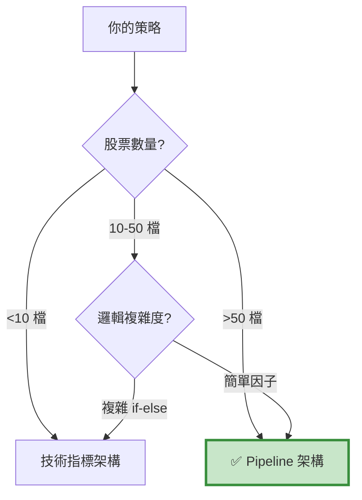

# Pipeline 因子架構 - 常見問題 FAQ

本頁整理使用 Pipeline 因子架構時最常遇到的問題與解決方案。

---

## 📑 目錄

- [基礎概念](#basics)
- [CustomFactor 開發](#customfactor)
- [Pipeline 組合](#pipeline)
- [數據處理](#data-process)
- [效能優化](#optimize)
- [除錯技巧](#debug)
- [實務應用](#practice)

---

## 基礎概念 {: #basics }

### Q1: Pipeline 架構 vs 其他架構，我該選哪個？

**決策流程圖：**


**快速判斷：**

| 架構 | 適用股票數 | 適用情境 | 學習難度 |
| :--- | :---: | :--- | :---: |
| Pipeline | 50-2000 | 因子選股、批次計算 | 🔴 高 |
| 技術指標 | 1-10 | 技術分析、靈活邏輯 | 🟢 低 |
| 財報選股 | 50-200 | 基本面選股、季度調倉 | 🟢 低 |

---

### Q2: Pipeline 的核心優勢是什麼？

**向量化計算的威力：**
```python
# ❌ Loop 方法（慢）
for stock in stock_list:  # 1000 檔
    history = data.history(stock, 'close', 252, '1d')
    momentum = calculate_momentum(history)
    # 1000 次 API 調用！

# ✅ Pipeline 方法（快）
class Momentum(CustomFactor):
    window_length = 252
    def compute(self, today, assets, out, close):
        out[:] = (close[-1] - close[0]) / close[0]
        # 一次計算 1000 檔！
```

**效能對比：**

| 股票數 | Loop 耗時 | Pipeline 耗時 | 加速比 |
| ---: | ---: | ---: | ---: |
| 10 | 1 秒 | 0.5 秒 | 2x |
| 100 | 10 秒 | 0.6 秒 | 17x |
| 1000 | 100 秒 | 1 秒 | 100x |

---

### Q3: 什麼時候 **不該** 用 Pipeline？

**不適合的情境：**

1. **少數標的（<10 檔）**
> - Loop 方法更直觀
> - Pipeline 的效能優勢不明顯
> - 學習成本不划算

2. **複雜邏輯（大量 if-else）**
> - Pipeline 難以實現複雜條件判斷
> - 需要根據當前持倉動態調整
> - 例如：金字塔加碼、動態停損

3. **高頻交易**
> - Pipeline 是日頻設計
> - 無法做分鐘級或 Tick 級交易

4. **需要即時反應**
> - Pipeline 在盤前計算
> - 無法根據盤中價格變化調整

---

## CustomFactor 開發 {: #customfactor }

### Q4: CustomFactor 的基本結構是什麼？

**完整模板：**
```python
from zipline.pipeline import CustomFactor
from zipline.pipeline.data import EquityPricing
import numpy as np

class MyFactor(CustomFactor):
    """
    因子說明文檔
    """
    # 需要多少天的資料
    window_length = 252
    
    # 需要哪些欄位
    inputs = [EquityPricing.close]
    
    def compute(self, today, assets, out, close):
        """
        計算邏輯
        
        Parameters:
        -----------
        today : pd.Timestamp
            當前日期
        assets : np.array
            股票代碼陣列 (長度 N)
        out : np.array
            輸出陣列 (長度 N，要填入結果)
        close : np.array
            收盤價矩陣 (window_length × N)
        """
        # 🔥 在這裡實作你的計算邏輯
        
        # 範例：計算報酬率
        returns = (close[-1] - close[0]) / close[0]
        
        # 填入輸出陣列
        out[:] = returns
```

**關鍵概念：**

- `window_length`：決定 `close` 矩陣的行數
- `inputs`：決定 `compute()` 的參數
- `out[:]`：必須賦值整個陣列（不能用迴圈逐個賦值）

---

### Q5: 如何處理多個輸入欄位？

**範例：計算價量比**
```python
class PriceToVolume(CustomFactor):
    window_length = 1
    inputs = [
        EquityPricing.close,
        EquityPricing.volume
    ]
    
    def compute(self, today, assets, out, close, volume):
        # 參數順序與 inputs 一致
        # close: (1 × N)
        # volume: (1 × N)
        
        # 取最新值
        latest_close = close[-1]
        latest_volume = volume[-1]
        
        # 計算比值（避免除以零）
        ratio = latest_close / (latest_volume + 1e-10)
        
        out[:] = ratio
```

**注意事項：**
```python
# ❌ 錯誤：參數名稱可以隨意
def compute(self, today, assets, out, x, y):
    # x 對應第一個 input (close)
    # y 對應第二個 input (volume)

# ✅ 正確：建議使用有意義的名稱
def compute(self, today, assets, out, close, volume):
    # 可讀性更好
```

---

### Q6: 如何處理 NaN 值？

**問題情境：**
```python
# 某些股票可能沒有完整的 252 天資料
# 導致 close 矩陣中有 NaN
```

**解決方案：**
```python
class SafeMomentum(CustomFactor):
    window_length = 252
    inputs = [EquityPricing.close]
    
    def compute(self, today, assets, out, close):
        # 方法 1: 使用 nanmean, nanstd 等函數
        returns = (close[-1] - close[0]) / close[0]
        out[:] = np.where(np.isnan(returns), np.nan, returns)
        
        # 方法 2: 逐檔檢查（較慢）
        for i in range(len(assets)):
            prices = close[:, i]
            if np.isnan(prices).any():
                out[i] = np.nan
            else:
                out[i] = (prices[-1] - prices[0]) / prices[0]
        
        # 方法 3: 用 mask 過濾（推薦）
        # 在 Pipeline 定義時加入 mask
```

**最佳實踐：**
```python
# 在 make_pipeline() 中使用 mask
def make_pipeline():
    # 定義股票池（自動過濾資料不足的股票）
    universe = AverageDollarVolume(window_length=30).top(500)
    
    # 因子計算時只考慮 universe 內的股票
    momentum = Momentum(mask=universe)
    
    return Pipeline(
        columns={'momentum': momentum},
        screen=universe
    )
```

---

### Q7: 向量化計算的常見錯誤？

**錯誤 1：用迴圈**
```python
# ❌ 錯誤
class SlowFactor(CustomFactor):
    def compute(self, today, assets, out, close):
        for i in range(len(assets)):
            out[i] = close[:, i].mean()  # 慢！

# ✅ 正確
class FastFactor(CustomFactor):
    def compute(self, today, assets, out, close):
        out[:] = np.mean(close, axis=0)  # 快！
```

**錯誤 2：忘記 axis 參數**
```python
# ❌ 錯誤
out[:] = np.mean(close)  # 計算所有股票的平均（錯誤）

# ✅ 正確
out[:] = np.mean(close, axis=0)  # 每檔股票的平均（正確）
```

**axis 參數解釋：**
```
close 矩陣維度: (window_length × 股票數)

axis=0: 沿著時間軸計算（每檔股票）
axis=1: 沿著股票軸計算（每個時間點）

我們通常需要 axis=0
```

---

## Pipeline 組合 {: #pipeline }

### Q8: 如何組合多個因子？

**方法 1：直接組合**
```python
def make_pipeline():
    factor1 = Factor1()
    factor2 = Factor2()
    
    # 加權組合
    composite = 0.6 * factor1 + 0.4 * factor2
    
    return Pipeline(
        columns={'composite': composite}
    )
```

**方法 2：排名後組合**
```python
def make_pipeline():
    factor1 = Factor1()
    factor2 = Factor2()
    
    # 標準化為排名（0-1）
    rank1 = factor1.rank() / factor1.rank().max()
    rank2 = factor2.rank() / factor2.rank().max()
    
    # 加權組合
    composite = 0.6 * rank1 + 0.4 * rank2
    
    return Pipeline(
        columns={'composite': composite}
    )
```

**方法 3：篩選後組合**
```python
def make_pipeline():
    factor1 = Factor1()
    factor2 = Factor2()
    
    # 兩個因子都要通過
    screen = (factor1 > 0) & (factor2.top(100))
    
    return Pipeline(
        columns={
            'factor1': factor1,
            'factor2': factor2
        },
        screen=screen
    )
```

---

### Q9: screen 和 mask 有什麼差別？

**mask（在因子計算時使用）：**
```python
# 限制因子計算的範圍
universe = AverageDollarVolume().top(500)
momentum = Momentum(mask=universe)

# momentum 只會計算 universe 內的 500 檔
# 其他股票直接跳過（節省計算）
```

**screen（在 Pipeline 輸出時使用）：**
```python
# 過濾 Pipeline 輸出
screen = (momentum > 0)

pipe = Pipeline(
    columns={'momentum': momentum},
    screen=screen
)

# 所有股票都會計算 momentum
# 但只輸出 momentum > 0 的股票
```

**何時用 mask？何時用 screen？**
```python
# 用 mask：
# 1. 減少計算量（股票池很大）
# 2. 因子計算很慢

# 用 screen：
# 1. 動態篩選（根據因子值）
# 2. 組合多個條件
```

---

### Q10: 如何實現產業中性？

**方法 1：在 Pipeline 中分組**
```python
# 需要自定義 Classifier
from zipline.pipeline import Classifier

class IndustryClassifier(Classifier):
    """產業分類"""
    def compute(self, today, assets, out):
        # 從外部資料讀取產業分類
        for i, asset in enumerate(assets):
            out[i] = get_industry(asset.symbol)

def make_pipeline():
    industry = IndustryClassifier()
    momentum = Momentum()
    
    # 每個產業內排名
    industry_rank = momentum.rank(groupby=industry)
    
    # 選每個產業前 3 名
    screen = industry_rank.percentile_between(80, 100)
```

**方法 2：在 before_trading_start 中處理**
```python
def before_trading_start(context, data):
    output = pipeline_output('my_pipeline')
    
    # 手動加入產業分類
    output['industry'] = [get_industry(s) for s in output.index]
    
    # 每個產業選前 3 名
    stocks = []
    for industry in output['industry'].unique():
        industry_stocks = output[output['industry'] == industry]
        top3 = industry_stocks.nlargest(3, 'momentum')
        stocks.extend(top3.index.tolist())
    
    context.stocks = stocks
```

---

## 數據處理 {: #data-process }

### Q11: 如何整合外部數據（如 TEJ 財報）？

**挑戰：**

Pipeline 預設只能用 `EquityPricing`（OHLCV 資料），財報資料怎麼整合？

**方法 1：在 compute 內讀取（簡單但慢）**
```python
# 先載入財報資料到全域變數
fundamental_data = load_fundamental_data()

class ROEFactor(CustomFactor):
    window_length = 1
    
    def compute(self, today, assets, out):
        today_str = pd.Timestamp(today).strftime('%Y-%m-%d')
        
        for i, asset in enumerate(assets):
            symbol = asset.symbol
            
            # 從全域變數讀取
            roe = fundamental_data.loc[
                (fundamental_data['coid'] == symbol) &
                (fundamental_data['mdate'] == today_str),
                'roe'
            ].values
            
            out[i] = roe[0] if len(roe) > 0 else np.nan
```

**方法 2：自定義 DataSet（進階但快）**
```python
from zipline.pipeline.data import DataSet, Column

class Fundamentals(DataSet):
    roe = Column(dtype=float)
    pe_ratio = Column(dtype=float)
    debt_ratio = Column(dtype=float)

# 需要實作 Loader（較複雜，略）
```

---

### Q12: 如何處理數據延遲（look-ahead bias）？

**問題：**

財報通常有公告延遲（例如 Q1 財報在 5 月才公布）。

**解決方案：**
```python
class SafeROE(CustomFactor):
    """
    考慮公告延遲的 ROE 因子
    """
    window_length = 1
    
    def compute(self, today, assets, out):
        # 使用「已公告」的最新財報
        # 而非「會計期間」的最新財報
        
        for i, asset in enumerate(assets):
            # 找出 today 之前「已公告」的財報
            announced_data = fundamental_data[
                (fundamental_data['coid'] == asset.symbol) &
                (fundamental_data['announce_date'] <= today)
            ].sort_values('announce_date', ascending=False)
            
            if len(announced_data) > 0:
                out[i] = announced_data.iloc[0]['roe']
            else:
                out[i] = np.nan
```

**最佳實踐：**
```python
# TEJ 的 include_self_acc='Y' 參數
# 會包含自結數（提前 30 天）
data = TejToolAPI.get_history_data(
    ...,
    include_self_acc='Y'
)
```

---

## 效能優化 {: #optimize }

### Q13: 回測速度太慢怎麼辦？

**診斷步驟：**
```python
# Step 1: 確認瓶頸
import time

start = time.time()
output = pipeline_output('my_pipeline')
print(f"Pipeline 耗時: {time.time() - start:.2f} 秒")

start = time.time()
# ... 調倉邏輯 ...
print(f"調倉耗時: {time.time() - start:.2f} 秒")
```

**優化技巧：**

**技巧 1：減少股票池**
```python
# ❌ 慢：計算全市場 2000 檔
universe = StaticAssets(all_stocks)

# ✅ 快：只計算流動性高的 500 檔
universe = AverageDollarVolume().top(500)
```

**技巧 2：減少 window_length**
```python
# ❌ 慢：用 252 天
class MyFactor(CustomFactor):
    window_length = 252

# ✅ 快：縮短到 60 天
class MyFactor(CustomFactor):
    window_length = 60
```

**技巧 3：使用 mask**
```python
# ❌ 慢：計算所有股票
factor = MyFactor()

# ✅ 快：只計算 universe 內的
factor = MyFactor(mask=universe)
```

**技巧 4：減少因子數量**
```python
# ❌ 慢：計算 10 個因子
columns = {f'factor{i}': Factor(i) for i in range(10)}

# ✅ 快：只計算必要的 3 個
columns = {'momentum': Momentum(), 'value': Value(), 'quality': Quality()}
```

---

### Q14: 記憶體不足怎麼辦？

**問題情境：**
```python
# 全市場 2000 檔 × 252 天 × 10 個因子
# 需要大量記憶體
```

**解決方案：**

**方案 1：分批回測**
```python
# 將回測期間分段
periods = [
    ('2019-01-01', '2020-12-31'),
    ('2021-01-01', '2022-12-31'),
    ('2023-01-01', '2023-12-31')
]

all_results = []
for start, end in periods:
    results = run_algorithm(
        start=pd.Timestamp(start, tz='utc'),
        end=pd.Timestamp(end, tz='utc'),
        ...
    )
    all_results.append(results)

# 合併結果
combined = pd.concat(all_results)
```

**方案 2：減少 window_length**
```python
# 只保留必要的歷史資料
window_length = 60  # 而非 252
```

**方案 3：使用 SSD**
```python
# Zipline 會將資料快取到硬碟
# 使用 SSD 可以加速 I/O
```

---

## 除錯技巧 {: #debug }

### Q15: 如何 debug CustomFactor？

**方法 1：print 除錯**
```python
class DebugFactor(CustomFactor):
    window_length = 20
    inputs = [EquityPricing.close]
    
    def compute(self, today, assets, out, close):
        print(f"Today: {today}")
        print(f"Assets: {len(assets)}")
        print(f"Close shape: {close.shape}")
        print(f"Close sample:\n{close[:5, :5]}")
        
        returns = (close[-1] - close[0]) / close[0]
        print(f"Returns sample: {returns[:5]}")
        
        out[:] = returns
```

**方法 2：單獨測試**
```python
# 不跑回測，只測試 Pipeline
from zipline.pipeline.engine import SimplePipelineEngine
from zipline.pipeline.loaders import USEquityPricingLoader

# 建立測試環境
engine = SimplePipelineEngine(...)
result = engine.run_pipeline(
    make_pipeline(),
    start_date=pd.Timestamp('2023-01-01'),
    end_date=pd.Timestamp('2023-01-31')
)

print(result)
```

**方法 3：視覺化檢查**
```python
# 檢查因子值分佈
import matplotlib.pyplot as plt

output = pipeline_output('my_pipeline')
output['momentum'].hist(bins=50)
plt.title('Momentum Distribution')
plt.show()

# 檢查是否有異常值
print(output['momentum'].describe())
```

---

### Q16: Pipeline 沒有輸出任何股票？

**診斷步驟：**
```python
# Step 1: 檢查 screen 條件
def make_pipeline():
    factor = MyFactor()
    
    # 暫時移除 screen
    return Pipeline(
        columns={'factor': factor},
        # screen=factor > 0  # 註解掉
    )

# 檢查有多少股票通過
output = pipeline_output('my_pipeline')
print(f"總股票數: {len(output)}")
print(f"因子 > 0 的股票數: {(output['factor'] > 0).sum()}")
```

**常見原因：**

**原因 1：screen 太嚴格**
```python
# ❌ 太嚴格
screen = (factor1 > 0.5) & (factor2 < 0.1) & (factor3.top(10))

# ✅ 放寬條件
screen = (factor1 > 0) | (factor2 < 0.5)
```

**原因 2：mask 太小**
```python
# ❌ mask 只有 10 檔
universe = AverageDollarVolume().top(10)

# ✅ 擴大到 100 檔
universe = AverageDollarVolume().top(100)
```

**原因 3：因子值都是 NaN**
```python
# 檢查因子計算邏輯
output = pipeline_output('my_pipeline')
print(output['factor'].isnull().sum())  # 有多少 NaN？
```

---

## 實務應用 {: #practice }

### Q17: 如何把 Pipeline 策略部署到實盤？

**步驟：**

**Step 1：每日排程**
```python
# daily_pipeline.py
import schedule
import time
from datetime import datetime

def run_daily_pipeline():
    """每日執行 Pipeline"""
    today = datetime.now()
    
    # 執行 Pipeline
    output = run_pipeline_for_today()
    
    # 產生持倉清單
    stocks = output.nlargest(20, 'momentum').index.tolist()
    
    # 儲存結果
    save_portfolio(stocks, today)
    
    # 發送通知
    send_notification(f"今日選股完成：{len(stocks)} 檔")

# 每天下午 5 點執行
schedule.every().day.at("17:00").do(run_daily_pipeline)

while True:
    schedule.run_pending()
    time.sleep(60)
```

**Step 2：下單邏輯**
```python
def execute_orders():
    """執行調倉"""
    # 讀取目標持倉
    target_portfolio = load_portfolio()
    
    # 取得當前持倉
    current_positions = broker_api.get_positions()
    
    # 賣出不在清單的
    for stock in current_positions:
        if stock not in target_portfolio:
            broker_api.sell(stock)
    
    # 買入新股票
    for stock in target_portfolio:
        if stock not in current_positions:
            broker_api.buy(stock, weight=1/len(target_portfolio))
```

**Step 3：監控與容錯**
```python
def run_with_safety():
    try:
        run_daily_pipeline()
    except Exception as e:
        # 記錄錯誤
        log_error(e)
        
        # 發送警報
        send_alert(f"Pipeline 執行失敗：{e}")
        
        # 使用備用方案
        use_fallback_strategy()
```

---

### Q18: 如何評估因子有效性？

**方法 1：IC（Information Coefficient）**
```python
# 計算因子值與未來報酬的相關性
def calculate_ic(factor_values, forward_returns):
    """
    IC = 因子值與未來報酬的相關係數
    
    IC > 0.05: 有效因子
    IC > 0.10: 非常有效
    """
    from scipy.stats import spearmanr
    
    ic, p_value = spearmanr(factor_values, forward_returns)
    return ic

# 範例
output = pipeline_output('my_pipeline')

# 計算未來 20 日報酬
forward_returns = calculate_forward_returns(output.index, days=20)

# 計算 IC
ic = calculate_ic(output['momentum'], forward_returns)
print(f"因子 IC: {ic:.4f}")
```

**方法 2：多空組合測試**
```python
# 做多前 20%，做空後 20%
def backtest_long_short(factor_name):
    def before_trading_start(context, data):
        output = pipeline_output('my_pipeline')
        
        # 前 20%
        long_stocks = output.nlargest(
            int(len(output) * 0.2),
            factor_name
        ).index.tolist()
        
        # 後 20%
        short_stocks = output.nsmallest(
            int(len(output) * 0.2),
            factor_name
        ).index.tolist()
        
        context.long_stocks = long_stocks
        context.short_stocks = short_stocks
    
    def rebalance(context, data):
        # 做多
        for stock in context.long_stocks:
            order_target_percent(stock, 0.5 / len(context.long_stocks))
        
        # 做空（如果允許）
        for stock in context.short_stocks:
            order_target_percent(stock, -0.5 / len(context.short_stocks))
```

**方法 3：分層測試**
```python
# 將因子值分成 5 層，比較報酬
def quintile_analysis(output, forward_returns):
    # 分成 5 層
    output['quintile'] = pd.qcut(output['momentum'], 5, labels=[1,2,3,4,5])
    
    # 每層的平均報酬
    for q in range(1, 6):
        mask = output['quintile'] == q
        avg_return = forward_returns[mask].mean()
        print(f"第 {q} 層平均報酬: {avg_return:.2%}")
```

---

### Q19: 如何組合多個 Pipeline 策略？

**方法 1：集成多個 Pipeline**
```python
def initialize(context):
    # 註冊多個 Pipeline
    attach_pipeline(make_momentum_pipeline(), 'momentum')
    attach_pipeline(make_value_pipeline(), 'value')
    attach_pipeline(make_quality_pipeline(), 'quality')

def before_trading_start(context, data):
    # 取得所有結果
    momentum_stocks = pipeline_output('momentum').index.tolist()
    value_stocks = pipeline_output('value').index.tolist()
    quality_stocks = pipeline_output('quality').index.tolist()
    
    # 取交集
    context.stocks = list(
        set(momentum_stocks) & 
        set(value_stocks) & 
        set(quality_stocks)
    )
```

**方法 2：加權組合**
```python
def before_trading_start(context, data):
    momentum_output = pipeline_output('momentum')
    value_output = pipeline_output('value')
    
    # 標準化
    momentum_rank = momentum_output['momentum'].rank() / len(momentum_output)
    value_rank = value_output['value'].rank() / len(value_output)
    
    # 加權組合
    combined = pd.DataFrame({
        'score': 0.6 * momentum_rank + 0.4 * value_rank
    })
    
    # 選前 20 名
    context.stocks = combined.nlargest(20, 'score').index.tolist()
```

---

### Q20: 如何避免過度擬合？

**檢驗方法：**

**方法 1：樣本外測試**
```python
# 訓練期：2015-2020
train_results = run_algorithm(
    start=pd.Timestamp('2015-01-01', tz='utc'),
    end=pd.Timestamp('2020-12-31', tz='utc'),
    ...
)

# 測試期：2021-2023
test_results = run_algorithm(
    start=pd.Timestamp('2021-01-01', tz='utc'),
    end=pd.Timestamp('2023-12-31', tz='utc'),
    ...
)

# 比較夏普比率
print(f"訓練期 Sharpe: {train_results['sharpe'].iloc[-1]:.2f}")
print(f"測試期 Sharpe: {test_results['sharpe'].iloc[-1]:.2f}")

# 如果測試期明顯變差 → 過擬合
```

**方法 2：交叉驗證**
```python
# K-fold 交叉驗證
from sklearn.model_selection import TimeSeriesSplit

tscv = TimeSeriesSplit(n_splits=5)

sharpes = []
for train_idx, test_idx in tscv.split(date_range):
    train_start, train_end = date_range[train_idx[0]], date_range[train_idx[-1]]
    test_start, test_end = date_range[test_idx[0]], date_range[test_idx[-1]]
    
    results = backtest(train_start, train_end, test_start, test_end)
    sharpes.append(results['sharpe'])

print(f"平均 Sharpe: {np.mean(sharpes):.2f}")
print(f"標準差: {np.std(sharpes):.2f}")
```

**方法 3：參數穩定性測試**
```python
# 測試參數變化的影響
results = {}

for window in [200, 220, 240, 252, 280, 300]:
    sharpe = backtest_with_window(window)
    results[window] = sharpe

# 如果小幅調整參數就大幅影響績效 → 過擬合
print(results)
```

---

## 💡 最佳實踐總結

### ✅ DO（建議做）

1. **使用 mask 減少計算量**：`MyFactor(mask=universe)`
2. **優先使用向量化**：`np.mean(close, axis=0)` 而非迴圈
3. **處理 NaN**：使用 `np.nanmean`, `np.nanstd`
4. **樣本外測試**：訓練期 + 測試期分離
5. **視覺化檢查**：繪製因子分佈、相關性矩陣
6. **記錄關鍵指標**：用 `record()` 記錄持倉數、槓桿
7. **先小範圍測試**：100 檔 → 500 檔 → 2000 檔
8. **使用 Pyfolio 分析**：完整績效報告

### ❌ DON'T（避免做）

1. **不要在 compute 內用迴圈**：效能差 100 倍
2. **不要忽略 axis 參數**：`np.mean(close)` 是錯的
3. **不要過度優化參數**：調到小數點第三位
4. **不要忽略交易成本**：假設零成本
5. **不要只看報酬率**：忽略風險、回撤、週轉率
6. **不要跳過 mask**：浪費計算資源
7. **不要忘記 look-ahead bias**：注意數據延遲
8. **不要忽略 NaN**：會導致因子值錯誤

---

## 🔗 相關資源

- **架構說明**：[index.md](index.md)
- **Code 模板**：[template.md](template.md)
- **案例學習**：
  - [Expanded Momentum](case-momentum.md)
  - [跟隨大戶](case-institution.md)
  - [CounterTrend](case-countertrend.md)

---

**還有問題？**

如果這裡沒有涵蓋你的問題，請：

1. 檢查 [template.md](template.md) 的註解
2. 參考三個 case study 的實作
3. 回到 [overview.md](../Frameworks_Overview.md) 確認是否選對架構

**👉 準備好了？** 前往 [template.md](template.md) 開始開發你的 Pipeline 策略！