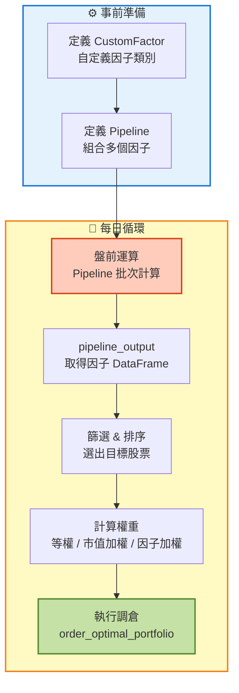
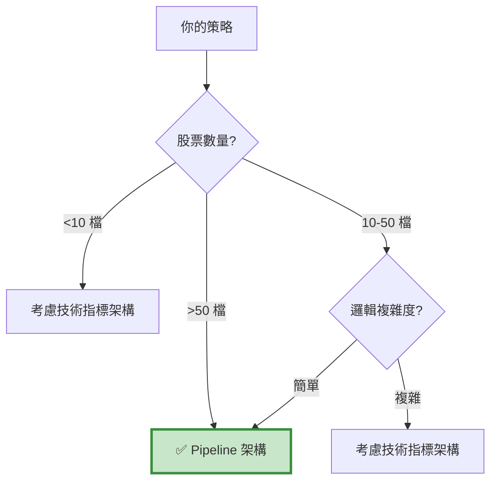

# 架構 C：Pipeline 因子架構 (Pipeline Factor Framework)

> **核心思想：批次計算，高效選股。**  
> "Compute once, apply to all."

---

## 📌 核心概念

Pipeline 因子架構的本質是「**盤前批次計算 + 統一調度**」的高效框架：
```
每個交易日開盤前：
Step 1: Pipeline 一次計算所有股票的因子值
Step 2: 根據因子值篩選、排序、分組
Step 3: 產生持倉清單（哪些股票、權重多少）
Step 4: 開盤後執行調倉（rebalance）
```

這種架構是量化交易的 **工業級標準**：

- 📊 **批次處理**：一次計算 2000 檔股票的因子
- ⚡ **極致效能**：向量化運算，速度快 10-100 倍
- 🔧 **模組化**：因子可插拔、可組合
- 📈 **可擴展**：從 10 檔到 10000 檔無痛升級

---

## 🎯 適用場景

### ✅ 最適合的情境

- **大規模股票池**：50-2000 檔股票
- **因子選股策略**：動量、價值、品質、低波動
- **多因子組合**：3-10 個因子加權
- **定期調倉**：日度、週度、月度

### ❌ 不適合的情境

- ❌ 少數標的（<10 檔）
- ❌ 複雜邏輯（需要 if-else 判斷）
- ❌ 高頻交易（分鐘級）
- ❌ 技術指標交叉訊號

---

## 🏗️ 架構特色

### 數據流向圖


### 關鍵設計理念

#### 1. 向量化計算的威力
```python
# ❌ Loop 方法（慢）
for stock in stock_list:  # 2000 檔
    close = data.history(stock, 'close', 20, '1d')
    ma = close.mean()
    # 2000 次 API 調用！

# ✅ Pipeline 方法（快）
class MA20(CustomFactor):
    window_length = 20
    def compute(self, today, assets, out, close):
        out[:] = np.mean(close, axis=0)
        # 一次計算 2000 檔！
```

**效能對比：**

| 股票數 | Loop 方法 | Pipeline 方法 | 加速比 |
| :--- | ---: | ---: | ---: |
| 10 檔 | 1 秒 | 0.5 秒 | 2x |
| 100 檔 | 10 秒 | 0.6 秒 | 17x |
| 1000 檔 | 100 秒 | 1 秒 | 100x |
| 2000 檔 | 200 秒 | 2 秒 | 100x |

#### 2. 因子即是 Feature
```python
# Pipeline 將「因子」視為「特徵」
# 類似機器學習的 Feature Engineering

# 定義多個因子
momentum = Returns(window_length=252)
volatility = AnnualizedVolatility(window_length=252)
value = PERatio()

# 組合因子
pipe = Pipeline(
    columns={
        'momentum': momentum,
        'volatility': volatility,
        'value': value
    }
)

# 產出 DataFrame
# Stock | momentum | volatility | value
# 2330  |   0.35   |    0.25    |  15.2
# 2317  |   0.28   |    0.30    |  12.8
# ...
```

#### 3. 選股邏輯的模組化
```python
# 模組 1: 定義因子
class MyFactor(CustomFactor):
    ...

# 模組 2: 定義篩選器
screen = (momentum > 0) & (volatility < 0.3)

# 模組 3: 定義 Pipeline
pipe = Pipeline(
    columns={'momentum': momentum},
    screen=screen
)

# 模組 4: 定義權重
def compute_weights(output):
    # 根據因子值計算權重
    return weights

# 各模組獨立，易於測試和替換
```

---

## 📊 與其他架構的差異

| 特性 | Pipeline 架構 | 技術指標架構 | 財報選股架構 |
| :--- | :---: | :---: | :---: |
| **運算時機** | 盤前批次 | 盤中即時 | 盤外預先 |
| **適用股票數** | 50-2000 | 1-10 | 50-200 |
| **效能** | 🟢 極快 | 🔴 慢 | 🟡 中 |
| **學習曲線** | 🔴 陡峭 | 🟢 平緩 | 🟢 平緩 |
| **彈性** | 🔴 低 | 🟢 極高 | 🟡 中 |
| **典型用途** | 因子投資 | 技術分析 | 基本面選股 |
| **調倉頻率** | 日/週/月 | 不定期 | 季/月 |

---

## 💡 何時選擇這個架構？

### 快速判斷檢查表


### 典型使用案例

- ✅ 動量策略（全市場掃描強勢股）
- ✅ 價值策略（低 PE、低 PB）
- ✅ 品質策略（高 ROE、低負債）
- ✅ 多因子組合（動量 + 價值 + 品質）
- ✅ Smart Beta（低波動、紅利、基本面）
- ✅ 機構追蹤（大戶持股變化）

---

## 🎓 學習路徑

### 新手入門（4 步驟）

1. **理解 CustomFactor**：自定義因子的計算邏輯
2. **學習 Pipeline**：如何組合因子
3. **閱讀案例**：先看 `case-momentum.md`
4. **複製模板**：前往 `template.md` 開始開發

### 進階優化

- 多因子加權（等權、市值加權、因子加權）
- 動態調倉頻率
- 風險控管（部位上限、產業中性）
- 交易成本優化

---

## 🔍 架構優勢與限制

### 優勢 ✅

1. **極致效能**
> - 向量化計算，速度快 100 倍
> - 可處理全市場 2000 檔股票
> - 適合大規模回測

2. **模組化設計**
> - 因子可插拔
> - 易於測試單一因子
> - 易於組合多因子

3. **工業級標準**
> - Quantopian、WorldQuant 使用的架構
> - 有大量開源因子庫
> - 社群資源豐富

4. **可擴展性**
> - 從 10 檔到 10000 檔無痛升級
> - 因子數量可任意增加
> - 支援複雜的篩選邏輯

### 限制 ⚠️

1. **學習曲線陡峭**
> - 需要理解 NumPy 向量化
> - CustomFactor 語法較抽象
> - Debug 困難

2. **彈性受限**
> - 難以實現複雜 if-else 邏輯
> - 無法根據當前持倉動態調整
> - 不適合高頻交易

3. **文檔較少**
> - Zipline 官方文檔不完整
> - 中文資源稀缺
> - 需要閱讀源碼

---

## 🛠️ 核心組件介紹

### 1. CustomFactor - 自定義因子
```python
from zipline.pipeline import CustomFactor
import numpy as np

class Momentum(CustomFactor):
    """
    動量因子：過去 N 天報酬率
    """
    window_length = 252  # 需要幾天的資料
    
    def compute(self, today, assets, out, close):
        """
        計算邏輯
        
        Parameters:
        -----------
        today : pd.Timestamp
            當前日期
        assets : np.array
            股票代碼陣列
        out : np.array
            輸出陣列（要填入計算結果）
        close : np.array
            收盤價矩陣（window_length × 股票數）
        """
        # 計算報酬率
        returns = (close[-1] - close[0]) / close[0]
        out[:] = returns
```

**關鍵概念：**

- `window_length`：需要多少天的歷史資料
- `inputs`：需要哪些欄位（close, volume, etc.）
- `compute`：計算邏輯（向量化）

### 2. Pipeline - 因子組合
```python
from zipline.pipeline import Pipeline

def make_pipeline():
    # 定義因子
    momentum = Momentum()
    volatility = Volatility()
    
    # 定義篩選器
    screen = (momentum > 0)
    
    # 組合 Pipeline
    pipe = Pipeline(
        columns={
            'momentum': momentum,
            'volatility': volatility
        },
        screen=screen
    )
    
    return pipe
```

### 3. pipeline_output() - 取得結果
```python
def before_trading_start(context, data):
    # 取得 Pipeline 輸出
    output = pipeline_output('my_pipeline')
    
    # output 是 DataFrame
    # Index: 股票代碼
    # Columns: 因子值
    
    # 選出前 10 名
    top10 = output.nlargest(10, 'momentum')
    
    # 儲存到 context
    context.stocks = top10.index.tolist()
```

### 4. rebalance() - 調倉函數
```python
def rebalance(context, data):
    # 計算目標權重
    weights = {}
    for stock in context.stocks:
        weights[stock] = 1.0 / len(context.stocks)
    
    # 執行調倉
    for stock, weight in weights.items():
        order_target_percent(stock, weight)
```

---

## ⚠️ 常見陷阱

### 陷阱 1：忘記向量化
```python
# ❌ 錯誤：用迴圈
class MyFactor(CustomFactor):
    def compute(self, today, assets, out, close):
        for i in range(len(assets)):
            out[i] = close[:, i].mean()  # 慢！

# ✅ 正確：向量化
class MyFactor(CustomFactor):
    def compute(self, today, assets, out, close):
        out[:] = np.mean(close, axis=0)  # 快！
```

### 陷阱 2：window_length 設定錯誤
```python
# ❌ 錯誤：需要 252 天資料，但只設 20
class Momentum(CustomFactor):
    window_length = 20  # 不夠！
    def compute(self, today, assets, out, close):
        returns = (close[-1] - close[-252]) / close[-252]
        # IndexError: 只有 20 筆資料

# ✅ 正確
class Momentum(CustomFactor):
    window_length = 252  # 足夠
    def compute(self, today, assets, out, close):
        returns = (close[-1] - close[0]) / close[0]
```

### 陷阱 3：忽略 NaN 處理
```python
# ❌ 錯誤：沒處理 NaN
class MyFactor(CustomFactor):
    def compute(self, today, assets, out, close):
        out[:] = np.mean(close, axis=0)
        # 如果有 NaN，結果也會是 NaN

# ✅ 正確：使用 nanmean
class MyFactor(CustomFactor):
    def compute(self, today, assets, out, close):
        out[:] = np.nanmean(close, axis=0)
```

---

## 📚 相關資源

- **模板頁面**：[template.md](template.md)
- **案例學習**：
  - [Expanded Momentum](case-momentum.md) - 動量策略
  - [跟隨大戶](case-institution.md) - 籌碼分析
  - [CounterTrend](case-countertrend.md) - 逆勢策略
- **常見問題**：[faq.md](faq.md)

---

## 💡 總結

Pipeline 因子架構適合：

- 📊 量化研究人員
- 🏭 大規模股票池（50+ 檔）
- ⚡ 追求極致效能
- 🔬 因子投資愛好者

**核心優勢：**

1. ✅ 效能極致（向量化計算）
2. ✅ 模組化設計（因子可插拔）
3. ✅ 可擴展性強（10 檔到 10000 檔）
4. ✅ 工業級標準（Quantopian 同款）

**使用限制：**

1. ⚠️ 學習曲線陡峭
2. ⚠️ 彈性受限（難以實現複雜邏輯）
3. ⚠️ Debug 困難

**👉 Next Step:** 前往 [template.md](template.md) 開始開發你的 Pipeline 策略！

---

## 📖 延伸閱讀

**Pipeline 設計哲學：**

- 受 Pandas 啟發的聲明式 API
- 類似 SQL 的查詢思維
- 向量化優先（避免迴圈）

**適合的策略類型：**

- 統計套利（多空對沖）
- Smart Beta（因子投資）
- 量化選股（多因子模型）
- 事件驅動（earnings、分拆）

本架構是從 **Quantopian** 移植而來，已被全球數萬量化交易者驗證。