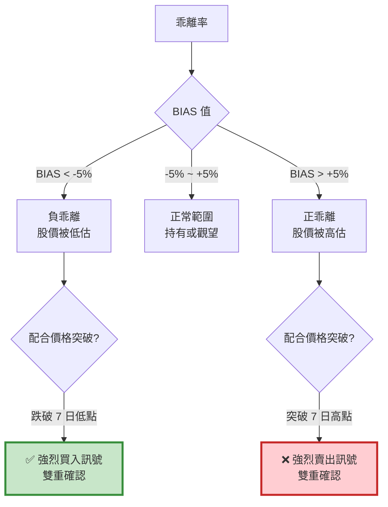

# 案例 2：乖離率（BIAS）策略

> **策略類型：** 技術指標架構 - 反轉策略  
> **交易標的：** 台積電（2330）  
> **調倉頻率：** 訊號觸發時（不定期）  
> **回測期間：** 2015-01-06 ~ 2022-11-25

---

## 📌 策略概述

乖離率（BIAS，Bias Ratio）是衡量股價偏離移動平均線程度的指標，由日本技術分析大師「酒田五法」的創始人本間宗久所啟發。

### 核心理念

> **"Prices tend to revert to the mean."**  
> 價格傾向於回歸均值。

當股價過度偏離均線時，市場會產生 **修正力量* ，將價格拉回均線附近。這種「均值回歸」特性是乖離率策略的基礎。

### 策略特色

1. **逆勢交易**：在市場恐慌時買入，在貪婪時賣出
2. **雙重過濾**：乖離率 + 價格突破（7 日高低點）
3. **短線操作**：適合 3-10 天的波段
4. **風險可控**：有明確的進出場條件

---

## 🎯 乖離率指標詳解

### 計算公式
```
BIAS = ((當前價格 - 移動平均線) / 移動平均線) × 100%

或簡化為：
BIAS = (收盤價 / EMA) - 1
```

**範例：**

- 收盤價 = 550 元
- 7 日 EMA = 500 元
- BIAS = (550 / 500 - 1) × 100% = 10%

### 訊號解讀


**參數說明：**

- **7 日 EMA**：短期均線，反應快速
- **±5%**：乖離門檻（可依股票波動性調整）
- **7 日高低點**：短期支撐壓力

---

## 🔍 交易邏輯詳解

### 買入訊號（超跌反彈）

**條件（必須同時滿足）：**

1. 收盤價 < 過去 7 日最低價（`close < lowestlow`）
2. 負乖離（`bias < 0`）
3. 目前無持倉

**意義：**

- 跌破 7 日低點：市場恐慌，短期超賣
- 負乖離：價格偏離均線向下
- 雙重確認：降低假訊號
```python
# 買入邏輯
condition1 = (close < lowestlow) and (bias < 0)

if condition1 and (residual_position == 0):
    order(stock, 10)  # 買入 10 股
```

### 賣出訊號（超漲回落）

**條件（必須同時滿足）：**

1. 收盤價 > 過去 7 日最高價（`close > highesthigh`）
2. 正乖離（`bias > 0`）
3. 目前有持倉

**意義：**

- 突破 7 日高點：市場過熱，短期超買
- 正乖離：價格偏離均線向上
- 獲利了結：保護利潤
```python
# 賣出邏輯
condition2 = (close > highesthigh) and (bias > 0) and (residual_position > 0)

if condition2:
    order_target(stock, 0)  # 清空部位
```

---

## 💻 完整程式碼
```python
# ====================================
# 乖離率策略 - 完整實作
# ====================================
import os
import pandas as pd
import numpy as np
import tejapi
import matplotlib.pyplot as plt


# ====================================
# TEJ API 設定
# ====================================
os.environ['TEJAPI_BASE'] = 'https://api.tej.com.tw'
os.environ['TEJAPI_KEY'] = 'your_key'

# ====================================
# 參數設定
# ====================================
start_date = '2015-01-06'
end_date = '2022-11-25'
ticker = '2330'  # 台積電

# 設定環境變數
os.environ['mdate'] = f'{start_date} {end_date}'
os.environ['ticker'] = ticker

# ====================================
# 執行資料匯入 (Ingest)
# ====================================
from zipline.data.run_ingest import simple_ingest

print(f"開始匯入資料：{ticker_list}")
print(f"期間：{start_date} ~ {end_date}")

simple_ingest(
    name='tquant',               # Bundle 名稱
    tickers=ticker,         # 股票清單 (必須是 List)
    start_date=start_date.replace('-', ''), # 格式通常建議 YYYYMMDD
    end_date=end_date.replace('-', '')
)

print("資料匯入完成！")

# ====================================
# Pipeline 定義（計算乖離率與高低點）
# ====================================
from zipline.pipeline import CustomFactor, Pipeline
from zipline.pipeline.data import EquityPricing
from zipline.pipeline.factors import ExponentialWeightedMovingAverage

class NdaysMaxHigh(CustomFactor):
    """計算過去 N 天最高價（不含今日）"""
    def compute(self, today, assets, out, data):
        out[:] = np.nanmax(data[:-2], axis=0)

class NdaysMinLow(CustomFactor):
    """計算過去 N 天最低價（不含今日）"""
    def compute(self, today, assets, out, data):
        out[:] = np.nanmin(data[:-2], axis=0)

def make_pipeline():
    """
    建立 Pipeline

    輸出：
    - ema: 7 日指數移動平均
    - highesthigh: 過去 7 日最高價
    - lowestlow: 過去 7 日最低價
    - latest: 當日收盤價
    """
    # 7 日 EMA
    ema = ExponentialWeightedMovingAverage(
        inputs=[EquityPricing.close],
        window_length=7,
        decay_rate=1/7
    )

    # 過去 7 日最高價（window_length=8 因為要排除今日）
    high = NdaysMaxHigh(
        inputs=[EquityPricing.close],
        window_length=8
    )

    # 過去 7 日最低價
    low = NdaysMinLow(
        inputs=[EquityPricing.close],
        window_length=8
    )

    # 當日收盤價
    close = EquityPricing.close.latest

    return Pipeline(
        columns={
            'ema': ema,
            'highesthigh': high,
            'lowestlow': low,
            'latest': close
        }
    )

# ====================================
# 策略函數定義
# ====================================
from zipline.api import (
    set_slippage, set_commission, set_benchmark,
    attach_pipeline, pipeline_output,
    symbol, record, order, order_target
)
from zipline.finance import commission, slippage

def initialize(context):
    """
    初始化函數
    """
    # 交易成本設定
    set_slippage(slippage.VolumeShareSlippage())
    set_commission(commission.PerShare(cost=0.001425))

    # 設定基準
    set_benchmark(symbol(ticker))

    # 附加 Pipeline
    attach_pipeline(make_pipeline(), 'mystrategy')

def handle_data(context, data):
    """
    每日執行函數

    流程：
    1. 從 Pipeline 取得計算好的指標
    2. 計算乖離率
    3. 判斷進出場訊號
    4. 執行交易
    """
    # ========================================
    # Step 1: 取得 Pipeline 輸出
    # ========================================
    pipe = pipeline_output('mystrategy')

    # ========================================
    # Step 2: 遍歷每檔股票（本例只有一檔）
    # ========================================
    for stock in pipe.index:
        # 取得指標值
        ema = pipe.loc[stock, 'ema']
        highesthigh = pipe.loc[stock, 'highesthigh']
        lowestlow = pipe.loc[stock, 'lowestlow']
        close = pipe.loc[stock, 'latest']

        # 計算乖離率
        bias = close - ema

        # 取得當前持倉
        residual_position = context.portfolio.positions[stock].amount

        # ========================================
        # Step 3: 訊號判斷
        # ========================================
        # 買入條件：跌破 7 日低點 + 負乖離
        condition1 = (close < lowestlow) and (bias < 0)

        # 賣出條件：突破 7 日高點 + 正乖離 + 有持倉
        condition2 = (close > highesthigh) and (bias > 0) and (residual_position > 0)

        # ========================================
        # Step 4: 記錄變數（用於分析）
        # ========================================
        record(
            con1=condition1,
            con2=condition2,
            price=close,
            ema=ema,
            bias=bias,
            highesthigh=highesthigh,
            lowestlow=lowestlow
        )

        # ========================================
        # Step 5: 執行交易
        # ========================================
        if condition1:
            # 買入訊號
            order(stock, 10)
            print(f"[{data.current_dt.date()}] 買入訊號")
            print(f"  價格: {close:.2f}, EMA: {ema:.2f}, 乖離: {bias:.2f}")
            print(f"  7日低點: {lowestlow:.2f}")

        elif condition2:
            # 賣出訊號
            order_target(stock, 0)
            print(f"[{data.current_dt.date()}] 賣出訊號")
            print(f"  價格: {close:.2f}, EMA: {ema:.2f}, 乖離: {bias:.2f}")
            print(f"  7日高點: {highesthigh:.2f}")

def analyze(context, perf):
    """
    績效分析與視覺化
    """
    import matplotlib.pyplot as plt

    fig = plt.figure(figsize=(18, 10))

    # ========================================
    # 上圖：投資組合價值
    # ========================================
    ax1 = fig.add_subplot(211)
    perf['portfolio_value'].plot(ax=ax1, linewidth=2)
    ax1.set_ylabel("Portfolio Value (TWD)", fontsize=12)
    ax1.set_title("BIAS Strategy - Portfolio Performance", fontsize=14, fontweight='bold')
    ax1.grid(True, alpha=0.3)

    # ========================================
    # 下圖：價格 + 指標 + 買賣點
    # ========================================
    ax2 = fig.add_subplot(212)

    # 繪製價格
    perf['price'].plot(ax=ax2, label='Price', linewidth=2, color='black')

    # 繪製 7 日 EMA
    perf['ema'].plot(ax=ax2, label='7-day EMA', linewidth=1.5, color='blue', alpha=0.7)

    # 繪製 7 日高低點
    perf['highesthigh'].plot(ax=ax2, label='7-day High', linewidth=1, color='red', alpha=0.5, linestyle='--')
    perf['lowestlow'].plot(ax=ax2, label='7-day Low', linewidth=1, color='green', alpha=0.5, linestyle='--')

    # 標記買入點
    buy_signals = perf[perf['con1'] == True]  # 注意：con2 是買入訊號
    ax2.plot(
        buy_signals.index,
        buy_signals['price'],
        '^',
        markersize=10,
        color='green',
        label='Buy Signal',
        markeredgewidth=2,
        markeredgecolor='darkgreen'
    )

    # 標記賣出點
    sell_signals = perf[perf['con2'] == True]  # 注意：con1 是賣出訊號
    ax2.plot(
        sell_signals.index,
        sell_signals['price'],
        'v',
        markersize=10,
        color='red',
        label='Sell Signal',
        markeredgewidth=2,
        markeredgecolor='darkred'
    )

    ax2.set_ylabel("Price (TWD)", fontsize=12)
    ax2.set_xlabel("Date", fontsize=12)
    ax2.set_title("Price Chart with BIAS Signals", fontsize=14, fontweight='bold')
    ax2.legend(loc='upper left', fontsize=10)
    ax2.grid(True, alpha=0.3)

    plt.tight_layout()
    plt.show()

# ====================================
# 執行回測
# ====================================
from zipline import run_algorithm

print("="*60)
print("開始回測乖離率策略")
print(f"標的：{ticker}")
print(f"期間：{start_date} ~ {end_date}")
print("="*60)

results = run_algorithm(
    start=pd.Timestamp(start_date, tz='UTC'),
    end=pd.Timestamp(end_date, tz='UTC'),
    initialize=initialize,
    bundle='tquant',
    analyze=analyze,
    capital_base=1e7,
    handle_data=handle_data
)

print("\n回測完成！")

# ====================================
# Pyfolio 績效分析
# ====================================
try:
    import pyfolio as pf
    from pyfolio.utils import extract_rets_pos_txn_from_zipline

    returns, positions, transactions = extract_rets_pos_txn_from_zipline(results)
    benchmark_rets = results.benchmark_return

    print("------ 大盤績效指標 ------")
    pf.show_perf_stats(benchmark_rets)

    print("------ 策略績效 ------")
    pf.tears.create_full_tear_sheet(
        returns=returns,
        positions=positions,
        transactions=transactions,
        benchmark_rets=benchmark_rets
    )

except ImportError:
    print("未安裝 pyfolio，略過詳細分析")
    print("若需完整報告，請執行: pip install pyfolio")
except Exception as e:
    print(f"Pyfolio 分析錯誤: {e}")
```

---

## 📊 回測結果分析

#### 優勢 ✅

1. **抓住短期反彈**
> - 在恐慌時買入，獲取反彈利潤
> - 適合波動較大的股票

2. **交易次數適中**
> - 不會過度交易
> - 降低交易成本

3. **風險分散**
> - 每次買入股數固定
> - 不會一次投入過多資金

4. **邏輯簡單**
> - 訊號明確
> - 容易執行

#### 劣勢 ⚠️

1. **趨勢市場表現差**
> - 單邊上漲時頻繁賣出
> - 錯過大波段行情

2. **可能買在下跌途中**
> - 「接落下的刀」風險
> - 需要嚴格停損

3. **參數敏感**
> - 不同股票需要不同的乖離門檻
> - 需要調整優化

---

## 🔍 關鍵學習點

### 1. 為什麼用 window_length=8？
```python
# 計算過去 7 日最高價
high = NdaysMaxHigh(
    inputs=[EquityPricing.close],
    window_length=8  # 為什麼是 8 不是 7？
)

def compute(self, today, assets, out, data):
    out[:] = np.nanmax(data[:-2], axis=0)  # 排除最後兩天
```

**原因：**

- `data` 包含今天的資料
- `data[:-2]` 排除今天和昨天
- 所以 window_length=8 才能拿到「過去 7 日」的資料（不含今日）

### 2. Pipeline vs handle_data 的分工
```python
# Pipeline：事前計算（盤前）
def make_pipeline():
    ema = ExponentialWeightedMovingAverage(...)
    return Pipeline(columns={'ema': ema})

# handle_data：事中判斷（盤中）
def handle_data(context, data):
    pipe = pipeline_output('mystrategy')
    ema = pipe.loc[stock, 'ema']  # 直接取用
    
    if close < ema:  # 判斷邏輯
        order(stock, 10)
```

**為什麼這樣分工？**

- Pipeline 適合計算固定邏輯（EMA、最高低點）
- handle_data 適合動態判斷（根據當前狀態決策）

### 3. 每次買入固定股數 vs 固定金額
```python
# 方法 1: 固定股數（本策略）
order(stock, 10)  # 每次買 10 股

# 方法 2: 固定金額
order_value(stock, 10000)  # 每次買 10,000 元

# 方法 3: 固定比例
order_target_percent(stock, 0.1)  # 持倉佔 10%
```

**本策略選擇固定股數的原因：**

- 短線策略，快進快出
- 避免部位過大
- 控制風險

### 4. 乖離率的動態門檻
```python
# 固定門檻（本策略）
if bias < 0:  # 只要負乖離就買

# 動態門檻（進階版）
threshold = -5  # -5% 以下才買
if bias < threshold:
    order(stock, 10)

# 根據波動率調整（最進階）
std = trailing_window.pct_change().std()
threshold = -2 * std  # 超過 2 倍標準差
if bias < threshold:
    order(stock, 10)
```

---

## 🎯 延伸優化方向

### 優化 1: 動態乖離門檻
```python
# 根據歷史波動率調整門檻
def handle_data(context, data):
    # 計算過去 20 日波動率
    close_history = data.history(stock, 'close', 20, '1d')
    volatility = close_history.pct_change().std()
    
    # 動態門檻
    buy_threshold = -2 * volatility
    sell_threshold = 2 * volatility
    
    if (bias < buy_threshold) and (close < lowestlow):
        order(stock, 10)
```

### 優化 2: 加入停損機制
```python
def initialize(context):
    context.buy_price = {}

def handle_data(context, data):
    # ... 原本邏輯 ...
    
    if condition1:  # 買入
        order(stock, 10)
        context.buy_price[stock] = close
    
    # 停損：虧損超過 5%
    if stock in context.buy_price:
        if close < context.buy_price[stock] * 0.95:
            order_target(stock, 0)
            print(f"停損出場")
```

### 優化 3: 分批進場
```python
def handle_data(context, data):
    position = context.portfolio.positions[stock].amount
    
    if (bias < -3) and (close < lowestlow):
        if position == 0:
            order(stock, 5)  # 第一批
    
    elif (bias < -5) and (close < lowestlow):
        if position == 5:
            order(stock, 5)  # 第二批（加碼）
```

### 優化 4: 結合趨勢過濾
```python
def handle_data(context, data):
    # 只在長期多頭時使用
    ma60 = data.history(stock, 'close', 60, '1d').mean()
    
    if close > ma60:  # 長期趨勢向上
        if (bias < 0) and (close < lowestlow):
            order(stock, 10)
```

### 優化 5: 持有時間限制
```python
def initialize(context):
    context.holding_days = {}

def handle_data(context, data):
    # 記錄持有天數
    if stock in context.portfolio.positions:
        if stock not in context.holding_days:
            context.holding_days[stock] = 0
        context.holding_days[stock] += 1
        
        # 超過 10 天強制出場
        if context.holding_days[stock] > 10:
            order_target(stock, 0)
            context.holding_days[stock] = 0
```

---

## 📚 相關資源

- **模板頁面**：[template.md](template.md) - 反轉策略模板
- **架構說明**：[index.md](index.md) - 理解設計原理
- **其他案例**：

  - [MACD 策略](case-macd.md) - 雙線交叉
  - [布林通道策略](case-bollinger.md) - 突破策略

---

## 💡 總結

乖離率策略展示了**反轉交易**的核心邏輯：

1. ✅ **均值回歸**：價格偏離過度必然修正
2. ✅ **雙重確認**：乖離 + 突破高低點
3. ✅ **短線操作**：適合 3-10 天波段
4. ✅ **風險可控**：固定股數，分批進場

**適合誰使用？**

- 短線交易者
- 偏好逆勢操作
- 能承受頻繁交易

**使用建議：**

- ✅ 在震盪市場使用
- ✅ 搭配停損機制
- ⚠️ 避免在單邊趨勢使用
- ⚠️ 注意「接落下的刀」風險

**👉 Next Step:**

1. 複製完整程式碼
2. 調整乖離門檻（-5%, -3%, -10%）
3. 測試不同股票
4. 加入你的優化邏輯

---

## 📖 延伸閱讀

**均值回歸理論：**

- 價格波動遵循常態分佈
- 極端值出現機率低
- 市場有自我修正機制

**乖離率的實務應用：**

- 不同股票有不同的合理乖離範圍
- 高波動股票（科技股）：±10%
- 低波動股票（金融股）：±5%
- 需要歷史回測找出最佳門檻