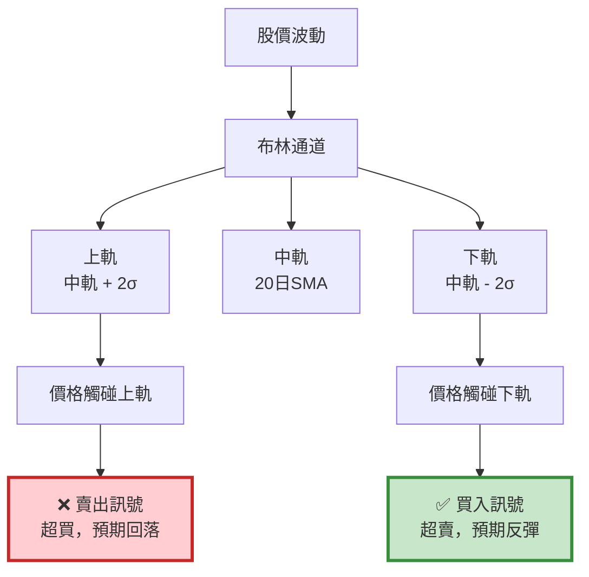

# 案例 3：布林通道（Bollinger Bands）策略

> **策略類型：** 技術指標架構 - 突破策略  
> **交易標的：** 友達（2409）  
> **調倉頻率：** 訊號觸發時（不定期）  
> **回測期間：** 2021-06-01 ~ 2022-12-31

---

## 📌 策略概述

布林通道（Bollinger Bands）由 John Bollinger 於 1980 年代發明，是最廣泛使用的技術指標之一。

### 核心理念

> **"Markets fluctuate within statistical boundaries."**  
> 市場在統計邊界內波動。

布林通道利用 **統計學的常態分佈理論** ：在常態分佈下，95.44% 的樣本會落在正負兩個標準差內。當股價超出這個範圍時，產生反轉的機率大幅上升。

### 策略特色

1. **統計學基礎**：基於標準差計算通道寬度
2. **動態調整**：通道隨波動率自動擴張收縮
3. **反轉交易**：觸碰上軌賣出、下軌買入
4. **加碼機制**：價格持續下跌時分批加碼

---

## 🎯 布林通道指標詳解

### 計算公式
```
中軌（Middle Band）= 20 日簡單移動平均線（SMA）

上軌（Upper Band）= 中軌 + (2 × 標準差)

下軌（Lower Band）= 中軌 - (2 × 標準差)

標準差（STD）= √(Σ(收盤價 - 中軌)² / 20)
```

**參數說明：**

- **20**：移動平均週期
- **2**：標準差倍數（K 值）

### 視覺化解釋


### 通道寬度的意義

**通道收縮（低波動）：**

- 市場平靜，醞釀大行情
- 即將突破（方向不確定）

**通道擴張（高波動）：**

- 市場劇烈波動
- 趨勢確立或恐慌

---

## 🔍 交易邏輯詳解

### 買入訊號（觸碰下軌）

**情境 1：首次買入**

條件：

- 收盤價 ≤ 下軌（`curr_price <= lower`）
- 現金足夠（`cash_position >= curr_price * 1000`）
- 目前無持倉（`stock_position == 0`）

**情境 2：加碼買入**

條件：

- 收盤價 ≤ 下軌
- 收盤價 ≤ 上次買入價（`curr_price <= context.last_signal_price`）
- 現金足夠
- 目前有持倉（`stock_position > 0`）

**意義：**

- 價格跌破下軌：統計上超賣
- 持續下跌加碼：攤平成本
- 現金控管：避免過度槓桿
```python
# 買入邏輯
if stock_position == 0:
    if (curr_price <= lower) and (cash_position >= curr_price * 1000):
        order(stock, 1000)
        context.last_signal_price = curr_price

elif stock_position > 0:
    if (curr_price <= lower) and \
       (curr_price <= context.last_signal_price) and \
       (cash_position >= curr_price * 1000):
        order(stock, 1000)  # 加碼
        context.last_signal_price = curr_price
```

### 賣出訊號（觸碰上軌）

**條件（必須同時滿足）：**

- 收盤價 ≥ 上軌（`curr_price >= upper`）
- 目前有持倉（`stock_position > 0`）

**意義：**

- 價格突破上軌：統計上超買
- 獲利了結：保護利潤
- 清空部位：等待下次機會
```python
# 賣出邏輯
if (curr_price >= upper) and (stock_position > 0):
    order_target(stock, 0)  # 全部賣出
    context.last_signal_price = 0
```

---

## 💻 完整程式碼
```python
# ====================================
# 布林通道策略 - 完整實作
# ====================================

import os
import pandas as pd
import numpy as np
import tejapi
import matplotlib.pyplot as plt

# ====================================
# TEJ API 設定
# ====================================
os.environ['TEJAPI_BASE'] = 'https://api.tej.com.tw'
os.environ['TEJAPI_KEY'] = 'your_key'

# ====================================
# 參數設定
# ====================================
start_date = '2021-04-01'
end_date = '2022-12-31'
ticker = '2409'  # 友達

# 設定環境變數
os.environ['mdate'] = f'{start_date} {end_date}'
os.environ['ticker'] = ticker

# ====================================
# 匯入股價資料
# ====================================
# 在 Jupyter 中執行：
# !zipline ingest -b tquant

# ====================================
# Pipeline 定義（計算布林通道）
# ====================================
from zipline.pipeline import Pipeline
from zipline.pipeline.data import EquityPricing
from zipline.pipeline.factors import BollingerBands

def make_pipeline():
    """
    建立 Pipeline
    
    輸出：
    - upper: 布林通道上軌
    - middle: 布林通道中軌
    - lower: 布林通道下軌
    - curr_price: 當日收盤價
    """
    # 布林通道（20 日，2 倍標準差）
    perf = BollingerBands(
        inputs=[EquityPricing.close],
        window_length=20,
        k=2
    )
    
    upper, middle, lower = perf.upper, perf.middle, perf.lower
    curr_price = EquityPricing.close.latest
    
    return Pipeline(
        columns={
            'upper': upper,
            'middle': middle,
            'lower': lower,
            'curr_price': curr_price
        }
    )

# ====================================
# 策略函數定義
# ====================================
from zipline.api import (
    set_slippage, set_commission, set_benchmark,
    attach_pipeline, pipeline_output,
    symbol, record, order, order_target
)
from zipline.finance import commission, slippage

def initialize(context):
    """
    初始化函數
    """
    # 記錄上次買入訊號價格
    context.last_signal_price = 0
    
    # 交易成本設定
    set_slippage(slippage.VolumeShareSlippage())
    set_commission(commission.PerShare(cost=0.001425))
    
    # 設定基準
    set_benchmark(symbol(ticker))
    
    # 附加 Pipeline
    attach_pipeline(make_pipeline(), 'mystrategy')

def handle_data(context, data):
    """
    每日執行函數
    
    流程：
    1. 從 Pipeline 取得布林通道值
    2. 判斷進出場訊號
    3. 執行交易（含加碼邏輯）
    """
    # ========================================
    # Step 1: 取得 Pipeline 輸出
    # ========================================
    out_dir = pipeline_output('mystrategy')
    
    # ========================================
    # Step 2: 遍歷每檔股票（本例只有一檔）
    # ========================================
    for stock in out_dir.index:
        # 取得布林通道值
        upper = out_dir.loc[stock, 'upper']
        middle = out_dir.loc[stock, 'middle']
        lower = out_dir.loc[stock, 'lower']
        curr_price = out_dir.loc[stock, 'curr_price']
        
        # 取得當前狀態
        cash_position = context.portfolio.cash
        stock_position = context.portfolio.positions[stock].amount
        
        # 初始化訊號
        buy, sell = False, False
        
        # ========================================
        # Step 3: 記錄變數
        # ========================================
        record(
            price=curr_price,
            upper=upper,
            lower=lower,
            buy=buy,
            sell=sell
        )
        
        # ========================================
        # Step 4: 交易邏輯
        # ========================================
        if stock_position == 0:
            # 情境 1：首次買入
            if (curr_price <= lower) and (cash_position >= curr_price * 1000):
                order(stock, 1000)
                context.last_signal_price = curr_price
                buy = True
                record(buy=buy)
                print(f"[{data.current_dt.date()}] 首次買入")
                print(f"  價格: {curr_price:.2f}, 下軌: {lower:.2f}")
        
        elif stock_position > 0:
            # 情境 2：加碼買入
            if (curr_price <= lower) and \
               (curr_price <= context.last_signal_price) and \
               (cash_position >= curr_price * 1000):
                order(stock, 1000)
                context.last_signal_price = curr_price
                buy = True
                record(buy=buy)
                print(f"[{data.current_dt.date()}] 加碼買入")
                print(f"  價格: {curr_price:.2f}, 上次買入: {context.last_signal_price:.2f}")
            
            # 情境 3：賣出
            elif (curr_price >= upper):
                order_target(stock, 0)
                context.last_signal_price = 0
                sell = True
                record(sell=sell)
                print(f"[{data.current_dt.date()}] 賣出")
                print(f"  價格: {curr_price:.2f}, 上軌: {upper:.2f}")

def analyze(context, perf):
    """
    績效分析與視覺化
    """
    import matplotlib.pyplot as plt
    
    fig = plt.figure(figsize=(18, 10))
    
    # ========================================
    # 上圖：投資組合價值
    # ========================================
    ax1 = fig.add_subplot(211)
    perf['portfolio_value'].plot(ax=ax1, linewidth=2)
    ax1.set_ylabel("Portfolio Value (TWD)", fontsize=12)
    ax1.set_title("Bollinger Bands Strategy - Portfolio Performance", 
                  fontsize=14, fontweight='bold')
    ax1.grid(True, alpha=0.3)
    
    # ========================================
    # 下圖：價格 + 布林通道 + 買賣點
    # ========================================
    ax2 = fig.add_subplot(212)
    
    # 繪製價格
    perf['price'].plot(ax=ax2, label='Price', linewidth=2, color='black')
    
    # 繪製布林通道
    perf['upper'].plot(ax=ax2, label='Upper Band', linewidth=1.5, 
                       color='red', alpha=0.7, linestyle='--')
    perf['lower'].plot(ax=ax2, label='Lower Band', linewidth=1.5, 
                       color='green', alpha=0.7, linestyle='--')
    
    # 標記買入點
    buy_signals = perf[perf['buy'] == True]
    ax2.plot(
        buy_signals.index,
        buy_signals['price'],
        '^',
        markersize=10,
        color='green',
        label='Buy Signal',
        markeredgewidth=2,
        markeredgecolor='darkgreen'
    )
    
    # 標記賣出點
    sell_signals = perf[perf['sell'] == True]
    ax2.plot(
        sell_signals.index,
        sell_signals['price'],
        'v',
        markersize=10,
        color='red',
        label='Sell Signal',
        markeredgewidth=2,
        markeredgecolor='darkred'
    )
    
    ax2.set_ylabel("Price (TWD)", fontsize=12)
    ax2.set_xlabel("Date", fontsize=12)
    ax2.set_title("Price Chart with Bollinger Bands", fontsize=14, fontweight='bold')
    ax2.legend(loc='upper left', fontsize=10)
    ax2.grid(True, alpha=0.3)
    
    plt.tight_layout()
    plt.show()

# ====================================
# 執行回測
# ====================================
from zipline import run_algorithm

print("="*60)
print("開始回測布林通道策略")
print(f"標的：{ticker}")
print(f"期間：{start_date} ~ {end_date}")
print("="*60)

results = run_algorithm(
    start=pd.Timestamp('2021-06-01', tz='UTC'),
    end=pd.Timestamp('2022-12-31', tz='UTC'),
    initialize=initialize,
    bundle='tquant',
    analyze=analyze,
    capital_base=5e5,
    handle_data=handle_data
)

print("\n回測完成！")

# ====================================
# 績效統計
# ====================================
print("\n========== 績效摘要 ==========")

initial_value = 5e5
final_value = results['portfolio_value'].iloc[-1]
total_return = (final_value / initial_value - 1) * 100
buy_hold_return = results['benchmark_period_return'].iloc[-1] * 100

print(f"初始資金: {initial_value:,.0f} 元")
print(f"最終資金: {final_value:,.0f} 元")
print(f"策略總報酬: {total_return:.2f}%")
print(f"買入持有報酬: {buy_hold_return:.2f}%")
print(f"超額報酬: {(total_return - buy_hold_return):.2f}%")

max_drawdown = results['max_drawdown'].min() * 100
print(f"\n最大回撤: {max_drawdown:.2f}%")

buy_count = results['buy'].sum()
sell_count = results['sell'].sum()
print(f"\n買入次數: {buy_count}")
print(f"賣出次數: {sell_count}")

results.to_csv(f'bollinger_results_{ticker}.csv')
print(f"\n詳細結果已儲存至: bollinger_results_{ticker}.csv")

# ====================================
# Pyfolio 績效分析
# ====================================
try:
    import pyfolio as pf
    from pyfolio.utils import extract_rets_pos_txn_from_zipline
    
    print("\n" + "="*60)
    print("Pyfolio 績效分析")
    print("="*60)
    
    # 提取報酬、持倉、交易數據
    returns, positions, transactions = extract_rets_pos_txn_from_zipline(results)
    benchmark_rets = results.benchmark_return
    
    # 生成完整績效報告
    pf.tears.create_full_tear_sheet(
        returns=returns,
        positions=positions,
        transactions=transactions,
        benchmark_rets=benchmark_rets
    )
    
except ImportError:
    print("\n未安裝 pyfolio，略過詳細分析")
    print("若需完整報告，請執行: pip install pyfolio")
except Exception as e:
    print(f"\nPyfolio 分析錯誤: {e}")
```

---

## 📊 策略特性分析

### 優勢 ✅

1. **統計學基礎扎實**
> - 基於常態分佈理論
> - 有明確的機率意義（95.44% 落在 ±2σ）

2. **動態調整能力**
> - 通道隨波動率自動調整
> - 高波動時通道變寬（容忍度提高）
> - 低波動時通道變窄（靈敏度提高）

3. **加碼機制**
> - 價格持續下跌時分批買入
> - 攤平成本
> - 提高獲利潛力

4. **風險控管**
> - 固定股數，控制部位
> - 現金檢查，避免過度槓桿
> - 有明確出場訊號

### 劣勢 ⚠️

1. **趨勢市場表現差**
> - 單邊上漲時會提早賣出
> - 錯過大波段行情
> - 適合震盪市場

2. **假突破風險**
> - 價格可能短暫突破後立即反轉
> - 造成虧損交易
> - 需要搭配其他指標過濾

3. **加碼風險**
> - 可能越攤越平
> - 資金壓力大
> - 需要嚴格的資金管理

4. **參數敏感**
> - 不同股票需要不同參數
> - 20 日、2σ 不一定適合所有股票
> - 需要回測優化

---

## 🔍 關鍵學習點

### 1. Pipeline 計算布林通道
```python
# 使用內建 BollingerBands
from zipline.pipeline.factors import BollingerBands

perf = BollingerBands(
    inputs=[EquityPricing.close],
    window_length=20,  # 移動平均週期
    k=2                # 標準差倍數
)

upper, middle, lower = perf.upper, perf.middle, perf.lower
```

**為什麼用 Pipeline？**

- 內建函數，計算正確
- 效能優異（批次處理）
- 程式碼簡潔

### 2. 加碼邏輯的實作
```python
# 關鍵：追蹤上次買入價格
context.last_signal_price = curr_price

# 只在價格更低時加碼
if (curr_price <= lower) and (curr_price <= context.last_signal_price):
    order(stock, 1000)
    context.last_signal_price = curr_price  # 更新
```

**為什麼要追蹤上次買入價？**

- 避免在同一價格重複買入
- 確保攤平成本（越買越低）
- 控制風險

### 3. 現金檢查的重要性
```python
# ❌ 錯誤：沒檢查現金
if curr_price <= lower:
    order(stock, 1000)  # 可能現金不足

# ✅ 正確：先檢查現金
if (curr_price <= lower) and (cash_position >= curr_price * 1000):
    order(stock, 1000)
```

**為什麼需要檢查？**

- 避免下單失敗
- 避免槓桿過高
- 保護帳戶安全

### 4. 賣出時重置價格記錄
```python
if curr_price >= upper:
    order_target(stock, 0)
    context.last_signal_price = 0  # 重置！
```

**為什麼要重置？**

- 清空持倉後，下次買入是「首次買入」
- 不是「加碼」
- 邏輯正確性

---

## 🎯 延伸優化方向

### 優化 1: 動態調整標準差倍數
```python
# 根據市場波動率調整 K 值
def make_pipeline():
    # 計算波動率
    volatility = Returns(window_length=20).stddev()
    
    # 高波動時用 K=2.5，低波動時用 K=1.5
    k_value = volatility.quantile_between(0, 1, bins=3)
    
    # 這需要自定義 CustomFactor
```

### 優化 2: 加入趨勢過濾
```python
def handle_data(context, data):
    # 只在長期趨勢向上時買入
    ma200 = data.history(stock, 'close', 200, '1d').mean()
    
    if curr_price > ma200:  # 長期多頭
        if curr_price <= lower:
            order(stock, 1000)
```

### 優化 3: 限制加碼次數
```python
def initialize(context):
    context.buy_count = 0

def handle_data(context, data):
    if curr_price <= lower:
        if context.buy_count < 3:  # 最多加碼 3 次
            order(stock, 1000)
            context.buy_count += 1
    
    if curr_price >= upper:
        order_target(stock, 0)
        context.buy_count = 0  # 重置計數
```

### 優化 4: 部分獲利了結
```python
def handle_data(context, data):
    if stock_position > 0:
        # 觸碰中軌時賣出一半
        if curr_price >= middle:
            order_target_percent(stock, 0.5)
        
        # 觸碰上軌時全部賣出
        elif curr_price >= upper:
            order_target(stock, 0)
```

### 優化 5: 通道擠壓策略
```python
# 通道寬度
bandwidth = (upper - lower) / middle

# 通道擠壓（醞釀大行情）
if bandwidth < bandwidth.rolling(50).mean() * 0.5:
    print("通道擠壓，準備突破")
    # 等待方向確認後進場
```

---

## 📚 相關資源

- **模板頁面**：[template.md](template.md) - 突破策略模板
- **架構說明**：[index.md](index.md) - 理解設計原理
- **其他案例**：

  - [MACD 策略](case-macd.md) - 雙線交叉
  - [乖離率策略](case-bias.md) - 反轉策略

---

## 💡 總結

布林通道策略展示了 **統計學** 在技術分析中的應用：

1. ✅ **理論基礎**：常態分佈，機率明確
2. ✅ **動態調整**：隨波動率自動適應
3. ✅ **反轉交易**：超買賣出、超賣買入
4. ✅ **加碼機制**：攤平成本，提高獲利

**適合誰使用？**

- 偏好統計方法的交易者
- 震盪市場操作
- 能承受加碼風險

**使用建議：**

- ✅ 在震盪市場使用
- ✅ 搭配趨勢過濾
- ✅ 嚴格資金管理
- ⚠️ 避免在單邊趨勢使用
- ⚠️ 注意加碼風險

**👉 Next Step:**

1. 複製完整程式碼
2. 調整參數（週期、K 值）
3. 測試不同股票
4. 加入你的優化邏輯

---

## 📖 延伸閱讀

**John Bollinger 的布林通道原則：**

1. 布林通道不是絕對的買賣訊號
2. 需搭配其他指標確認
3. 注意「行走通道邊緣」現象（強勢股會沿著上軌走）
4. 通道擠壓後常有大行情

**進階應用：**

- 布林通道 %B 指標（價格在通道中的位置）
- 布林通道寬度（BandWidth）
- 多時間框架布林通道
- 布林通道 + RSI 組合