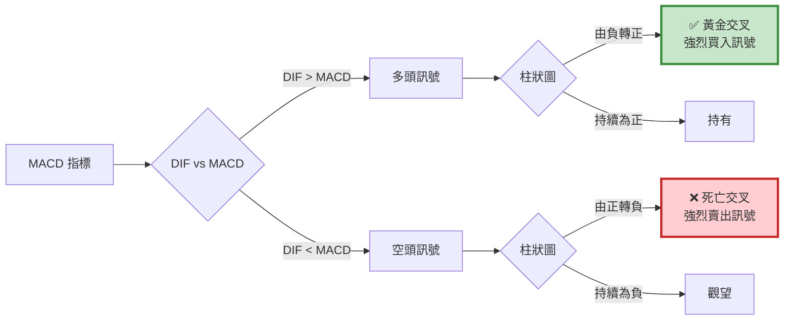

# 案例 1：MACD 交易策略

> **策略類型：** 技術指標架構 - 雙線交叉  
> **交易標的：** 台積電（2330）  
> **調倉頻率：** 訊號觸發時（不定期）  
> **回測期間：** 2018-12-30 ~ 2023-05-26

---

## 📌 策略概述

MACD（Moving Average Convergence Divergence，指數平滑異同移動平均線）是最經典的技術指標之一，由 Gerald Appel 於 1970 年代發明。

### 核心理念

> **"Follow the trend, but wait for confirmation."**  
> 跟隨趨勢，但等待確認訊號。

MACD 利用兩條不同速度的 **指數移動平均線（EMA）** 的差距變化，來判斷股價走勢的動能和方向。

### 策略特色

1. **雙重確認機制**：DIF 與 MACD 交叉 + 柱狀圖由負轉正
2. **趨勢跟隨**：適合有明顯趨勢的市場
3. **滯後指標**：避免追高殺低，等待趨勢確立
4. **簡單有效**：邏輯清晰，實務廣泛應用

---

## 🎯 MACD 指標詳解

### 計算公式
```
Step 1: 計算快線 EMA 與慢線 EMA
EMA(12) = (前一日 EMA(12) × 11 + 今日收盤價 × 2) ÷ 13
EMA(26) = (前一日 EMA(26) × 25 + 今日收盤價 × 2) ÷ 27

Step 2: 計算差離值 DIF
DIF = EMA(12) - EMA(26)

Step 3: 計算 MACD 線（DIF 的 9 日 EMA）
MACD = (前一日 MACD × 8 + DIF × 2) ÷ 10

Step 4: 計算柱狀圖（BAR）
BAR = DIF - MACD
```

**參數說明：**
- **12**：短期 EMA（快線）
- **26**：長期 EMA（慢線）
- **9**：DIF 的平滑週期

### 訊號解讀


---

## 🔍 交易邏輯詳解

### 買入訊號（黃金交叉）

**條件（必須同時滿足）：**

1. DIF 由下往上穿越 MACD（`dif[-2] < macd[-2]` 且 `dif[-1] > macd[-1]`）
2. 柱狀圖由負轉正（`bar[-2] < 0` 且 `bar[-1] > 0`）
3. 目前無持倉（`context.invested == False`）

**意義：**

- DIF > MACD：短期動能強於長期動能（趨勢向上）
- 柱狀圖轉正：確認訊號強度
- 雙重確認：降低假訊號

```python
# 買入邏輯
if (dif[-2] < macd[-2]) and (dif[-1] > macd[-1]) and \
   (bar[-2] < 0) and (bar[-1] > 0) and \
   not context.invested:
    
    order_target(context.sym, 1000)  # 買入 1000 股
    context.invested = True
```

### 賣出訊號（死亡交叉）

**條件（必須同時滿足）：**
1. DIF 由上往下穿越 MACD（`dif[-2] > macd[-2]` 且 `dif[-1] < macd[-1]`）
2. 柱狀圖由正轉負（`bar[-2] > 0` 且 `bar[-1] < 0`）
3. 目前有持倉（`context.invested == True`）

**意義：**
- DIF < MACD：短期動能轉弱（趨勢反轉）
- 柱狀圖轉負：確認趨勢改變
- 及時出場：保護獲利
```python
# 賣出邏輯
if (dif[-2] > macd[-2]) and (dif[-1] < macd[-1]) and \
   (bar[-2] > 0) and (bar[-1] < 0) and \
   context.invested:
    
    order_target(context.sym, 0)  # 清空部位
    context.invested = False
```

---

## 💻 完整程式碼
```python
# ====================================
# MACD 交易策略 - 完整實作
# ====================================

import os
import pandas as pd
import numpy as np
import talib
import matplotlib.pyplot as plt

# ====================================
# TEJ API 設定
# ====================================
os.environ['TEJAPI_BASE'] = 'https://api.tej.com.tw'
os.environ['TEJAPI_KEY'] = 'your_key'

# ====================================
# 參數設定
# ====================================
start_date = '2018-12-30'
end_date = '2023-05-26'
ticker = '2330'  # 台積電

# 設定環境變數
os.environ['mdate'] = f'{start_date} {end_date}'
os.environ['ticker'] = ticker

# ====================================
# 匯入股價資料
# ====================================
# 在 Jupyter 中執行：
# !zipline ingest -b tquant

# ====================================
# 策略函數定義
# ====================================
from zipline.api import (
    set_slippage, set_commission, symbol,
    record, order_target
)
from zipline.finance import commission, slippage

def initialize(context):
    """
    初始化函數
    
    設定：
    1. 交易成本
    2. 策略變數
    """
    # 交易成本設定
    context.set_commission(commission.PerDollar(cost=0.001425))
    context.set_slippage(slippage.VolumeShareSlippage())
    
    # 策略變數
    context.sym = symbol(ticker)
    context.i = 0
    context.invested = False

def handle_data(context, data):
    """
    每日執行函數
    
    流程：
    1. 抓取過去 35 天 K 線（26+9）
    2. 計算 MACD 指標
    3. 判斷交叉訊號
    4. 執行交易
    """
    # ========================================
    # Step 1: 抓取歷史資料
    # ========================================
    trailing_window = data.history(
        context.sym,
        'price',
        35,  # MACD(12,26,9) 需要 26+9=35 天
        '1d'
    )
    
    # 檢查資料完整性
    if trailing_window.isnull().values.any():
        return
    
    # ========================================
    # Step 2: 計算 MACD 指標
    # ========================================
    # 快線 EMA(12)
    short_ema = talib.EMA(trailing_window.values, timeperiod=12)
    
    # 慢線 EMA(26)
    long_ema = talib.EMA(trailing_window.values, timeperiod=26)
    
    # DIF = 快線 - 慢線
    dif = short_ema - long_ema
    
    # MACD = DIF 的 9 日 EMA
    MACD = talib.EMA(dif, timeperiod=9)
    
    # 柱狀圖 = DIF - MACD
    bar = dif - MACD
    
    # ========================================
    # Step 3: 訊號判斷
    # ========================================
    buy = False
    sell = False
    
    # 買入訊號：黃金交叉
    if (dif[-2] < MACD[-2]) and (dif[-1] > MACD[-1]) and \
       (bar[-2] < 0) and (bar[-1] > 0):
        
        if not context.invested:
            buy = True
    
    # 賣出訊號：死亡交叉
    elif (dif[-2] > MACD[-2]) and (dif[-1] < MACD[-1]) and \
         (bar[-2] > 0) and (bar[-1] < 0):
        
        if context.invested:
            sell = True
    
    # ========================================
    # Step 4: 執行交易
    # ========================================
    if buy:
        order_target(context.sym, 1000)
        context.invested = True
        print(f"[{data.current_dt.date()}] 黃金交叉 - 買入")
        print(f"  DIF: {dif[-1]:.2f}, MACD: {MACD[-1]:.2f}, BAR: {bar[-1]:.2f}")
    
    elif sell:
        order_target(context.sym, 0)
        context.invested = False
        print(f"[{data.current_dt.date()}] 死亡交叉 - 賣出")
        print(f"  DIF: {dif[-1]:.2f}, MACD: {MACD[-1]:.2f}, BAR: {bar[-1]:.2f}")
    
    # ========================================
    # Step 5: 記錄變數
    # ========================================
    record(
        TSMC=data.current(symbol(ticker), 'close'),
        dif=dif[-1],
        MACD=MACD[-1],
        bar=bar[-1],
        buy=buy,
        sell=sell
    )
    
    context.i += 1

def analyze(context, results):
    """
    績效分析與視覺化
    """
    import matplotlib.pyplot as plt
    
    fig = plt.figure(figsize=(18, 12))
    
    # ========================================
    # 上圖：投資組合價值
    # ========================================
    ax1 = fig.add_subplot(311)
    results['portfolio_value'].plot(ax=ax1, linewidth=2)
    ax1.set_ylabel('Portfolio Value (TWD)', fontsize=12)
    ax1.set_title('MACD Strategy - Portfolio Performance', fontsize=14, fontweight='bold')
    ax1.grid(True, alpha=0.3)
    
    # ========================================
    # 中圖：股價 + 買賣點
    # ========================================
    ax2 = fig.add_subplot(312)
    results['TSMC'].plot(ax=ax2, label='Price', linewidth=2, color='black')
    
    # 標記買入點
    buy_signals = results[results['buy'] == True]
    ax2.plot(
        buy_signals.index,
        buy_signals['TSMC'],
        '^',
        markersize=12,
        color='green',
        label='Buy Signal',
        markeredgewidth=2,
        markeredgecolor='darkgreen'
    )
    
    # 標記賣出點
    sell_signals = results[results['sell'] == True]
    ax2.plot(
        sell_signals.index,
        sell_signals['TSMC'],
        'v',
        markersize=12,
        color='red',
        label='Sell Signal',
        markeredgewidth=2,
        markeredgecolor='darkred'
    )
    
    ax2.set_ylabel('Price (TWD)', fontsize=12)
    ax2.set_title('Price Chart with Trade Signals', fontsize=14, fontweight='bold')
    ax2.legend(loc='upper left', fontsize=11)
    ax2.grid(True, alpha=0.3)
    
    # ========================================
    # 下圖：MACD 指標 + 柱狀圖
    # ========================================
    ax3 = fig.add_subplot(313)
    
    # 繪製 DIF 與 MACD 線
    results['dif'].plot(ax=ax3, label='DIF', linewidth=2, color='blue')
    results['MACD'].plot(ax=ax3, label='MACD', linewidth=2, color='red')
    
    # 繪製買入點（在 MACD 線上）
    ax3.plot(
        buy_signals.index,
        buy_signals['MACD'],
        '^',
        markersize=12,
        color='green',
        markeredgewidth=2,
        markeredgecolor='darkgreen'
    )
    
    # 繪製賣出點（在 MACD 線上）
    ax3.plot(
        sell_signals.index,
        sell_signals['MACD'],
        'v',
        markersize=12,
        color='red',
        markeredgewidth=2,
        markeredgecolor='darkred'
    )
    
    # 繪製柱狀圖（雙軸）
    ax3_twin = ax3.twinx()
    colors = ["red" if i > 0 else "green" for i in results['bar']]
    ax3_twin.bar(
        results.index,
        results['bar'],
        color=colors,
        alpha=0.3,
        width=0.8,
        label='MACD Histogram'
    )
    
    # 設定 Y 軸標籤
    ax3.set_ylabel('MACD / DIF', fontsize=12)
    ax3_twin.set_ylabel('Histogram', fontsize=12)
    ax3.set_xlabel('Date', fontsize=12)
    ax3.set_title('MACD Indicator', fontsize=14, fontweight='bold')
    
    # 合併圖例
    lines1, labels1 = ax3.get_legend_handles_labels()
    lines2, labels2 = ax3_twin.get_legend_handles_labels()
    ax3.legend(lines1 + lines2, labels1 + labels2, loc='upper left', fontsize=11)
    
    ax3.grid(True, alpha=0.3)
    ax3.axhline(0, color='black', linewidth=1, linestyle='--', alpha=0.5)
    
    plt.tight_layout()
    plt.show()

# ====================================
# 執行回測
# ====================================
from zipline import run_algorithm

print("="*60)
print("開始回測 MACD 策略")
print(f"標的：{ticker}")
print(f"期間：{start_date} ~ {end_date}")
print("="*60)

results = run_algorithm(
    start=pd.Timestamp(start_date, tz='utc'),
    end=pd.Timestamp(end_date, tz='utc'),
    initialize=initialize,
    handle_data=handle_data,
    analyze=analyze,
    bundle='tquant',
    capital_base=1e6
)

print("\n回測完成！")

# ====================================
# Pyfolio 績效分析
# ====================================
try:
    import pyfolio as pf
    from pyfolio.utils import extract_rets_pos_txn_from_zipline
    
    returns, positions, transactions = extract_rets_pos_txn_from_zipline(results)
    benchmark_rets = results.benchmark_return

    print("------ 大盤績效指標 ------")
    pf.show_perf_stats(benchmark_rets)
    
    print("------ 策略績效 ------")
    pf.tears.create_full_tear_sheet(
        returns=returns,
        positions=positions,
        transactions=transactions,
        benchmark_rets=benchmark_rets
    )
    
except ImportError:
    print("未安裝 pyfolio，略過詳細分析")
    print("若需完整報告，請執行: pip install pyfolio")
except Exception as e:
    print(f"Pyfolio 分析錯誤: {e}")
```

---

## 📊 回測結果分析

### 策略特性

#### ✅ 優勢 (Strengths)

1. **趨勢捕捉能力強**
> * 在明顯趨勢中表現優異
> * 能夠抓住大波段行情

2. **雙重確認降低假訊號**
> * DIF 與 MACD 交叉
> * 柱狀圖轉折確認
> * 減少頻繁進出

3. **邏輯簡單易懂**
> * 訊號明確（金叉買、死叉賣）
> * 容易執行與回測

4. **風險可控**
> * 有明確出場訊號
> * 不會長期套牢

---

#### ⚠️ 劣勢 (Weaknesses)

1. **盤整市場表現差**
> * 橫盤時容易產生假訊號
> * 頻繁進出造成損失

2. **滯後性**
> * 等待交叉確認，進場較晚
> * 可能錯過初期漲幅

3. **回撤較大**
> * 趨勢反轉時反應較慢
> * 獲利回吐較多

---

## 🔍 關鍵學習點

### 1. 為什麼需要雙重確認？
```python
# ❌ 單一條件：容易假訊號
if dif[-1] > macd[-1]:
    buy = True

# ✅ 雙重確認：降低假訊號
if (dif[-2] < macd[-2]) and (dif[-1] > macd[-1]) and \
   (bar[-2] < 0) and (bar[-1] > 0):
    buy = True
```

**原因：**

- DIF 可能在 MACD 附近震盪
- 柱狀圖轉折確認動能強度
- 避免「假交叉」

### 2. 檢查資料完整性的重要性
```python
# ❌ 錯誤：未檢查
trailing_window = data.history(context.sym, 'price', 35, '1d')
dif = calculate_macd(trailing_window)  # 如果資料有 NaN 會出錯

# ✅ 正確：先檢查
trailing_window = data.history(context.sym, 'price', 35, '1d')
if trailing_window.isnull().values.any():
    return  # 資料不足，跳過
dif = calculate_macd(trailing_window)
```

**何時會遇到 NaN？**

- 股票剛上市（歷史資料不足）
- 停牌期間
- 回測初期（需要 warm-up）

### 3. 使用 [-1] 與 [-2] 的邏輯
```python
# dif[-1]：今天的 DIF
# dif[-2]：昨天的 DIF

# 檢查「昨天 < 今天」才算突破
if (dif[-2] < macd[-2]) and (dif[-1] > macd[-1]):
    # 昨天 DIF 在 MACD 下方
    # 今天 DIF 在 MACD 上方
    # → 發生黃金交叉
```

**為什麼不用 `dif[-1] > dif[-2]`？**

- 這只檢查 DIF 是否上升
- 但沒檢查是否穿越 MACD
- 兩者概念不同

### 4. talib 的使用技巧
```python
# EMA 計算
ema = talib.EMA(
    trailing_window.values,  # 必須是 numpy array，不能是 pandas Series
    timeperiod=12            # 週期參數
)

# 回傳值也是 numpy array
print(type(ema))  # <class 'numpy.ndarray'>

# 取最新值
latest_ema = ema[-1]
```

---

## 🎯 延伸優化方向

### 優化 1: 加入趨勢過濾器
```python
# 只在明確趨勢中交易
ma200 = talib.SMA(trailing_window.values, timeperiod=200)

# 只在價格 > 200MA 時買入（多頭市場）
if (dif[-1] > macd[-1]) and (current_price > ma200[-1]):
    buy = True
```

### 優化 2: 動態停損停利
```python
def handle_data(context, data):
    # ... 原本邏輯 ...
    
    if context.invested:
        current_price = data.current(context.sym, 'price')
        
        # ATR 停損
        atr = talib.ATR(high.values, low.values, close.values, timeperiod=14)
        stop_loss = context.buy_price - (atr[-1] * 2)
        
        if current_price < stop_loss:
            order_target(context.sym, 0)
            context.invested = False
            print(f"ATR 停損出場")
```

### 優化 3: 參數優化
```python
# 測試不同參數組合
best_sharpe = 0
best_params = None

for fast in range(8, 16):
    for slow in range(20, 32):
        for signal in range(7, 12):
            results = backtest_macd(fast, slow, signal)
            if results['sharpe'] > best_sharpe:
                best_sharpe = results['sharpe']
                best_params = (fast, slow, signal)

print(f"最佳參數: {best_params}")
print(f"最佳夏普: {best_sharpe:.2f}")
```

### 優化 4: 加入成交量確認
```python
# 突破時成交量需放大
volume = data.history(context.sym, 'volume', 20, '1d')
avg_volume = talib.SMA(volume.values, timeperiod=20)
current_volume = data.current(context.sym, 'volume')

# 買入條件加入量能確認
if (dif[-1] > macd[-1]) and (current_volume > avg_volume[-1] * 1.2):
    buy = True
```

### 優化 5: 金字塔加碼
```python
def handle_data(context, data):
    # ... 計算 MACD ...
    
    if buy_signal:
        if not context.invested:
            # 首次買入 1000 股
            order(context.sym, 1000)
            context.invested = True
            context.position_count = 1
        
        elif (bar[-1] > bar[-2]) and (context.position_count < 3):
            # 柱狀圖持續放大，加碼
            order(context.sym, 500)
            context.position_count += 1
            print(f"加碼至 {context.position_count} 個單位")
```

---

## 📚 相關資源

- **模板頁面**：[template.md](template.md) - 雙線交叉模板
- **架構說明**：[index.md](index.md) - 理解設計原理
- **其他案例**：
  - [乖離率策略](case-bias.md) - 反轉策略
  - [布林通道策略](case-bollinger.md) - 突破策略

---

## 💡 總結

MACD 策略展示了技術指標架構的核心優勢：

1. ✅ **邏輯直觀**：與手動看盤一致
2. ✅ **訊號明確**：金叉買、死叉賣
3. ✅ **雙重確認**：降低假訊號
4. ✅ **趨勢跟隨**：適合波段操作

**適合誰使用？**

- 技術分析愛好者
- 偏好趨勢跟隨策略
- 中長線波段交易者

**使用建議：**

- ✅ 在趨勢明確的市場使用
- ✅ 搭配其他指標過濾（如均線、成交量）
- ⚠️ 避免在盤整市場使用
- ⚠️ 注意滯後性，可能錯過初期漲幅

**👉 Next Step:**  

1. 複製完整程式碼到 Jupyter Notebook
2. 修改參數（快線、慢線、訊號線）
3. 測試不同股票
4. 加入你的優化邏輯

---

## 📖 延伸閱讀

**Gerald Appel 的 MACD 原則：**

1. 用於判斷趨勢方向與強度
2. 不是絕對的買賣訊號
3. 需搭配其他分析工具
4. 注意背離現象（價格與 MACD 不一致）

**進階應用：**

- MACD 背離（Divergence）
- MACD 柱狀圖策略
- 多時間框架 MACD
- MACD + RSI 組合