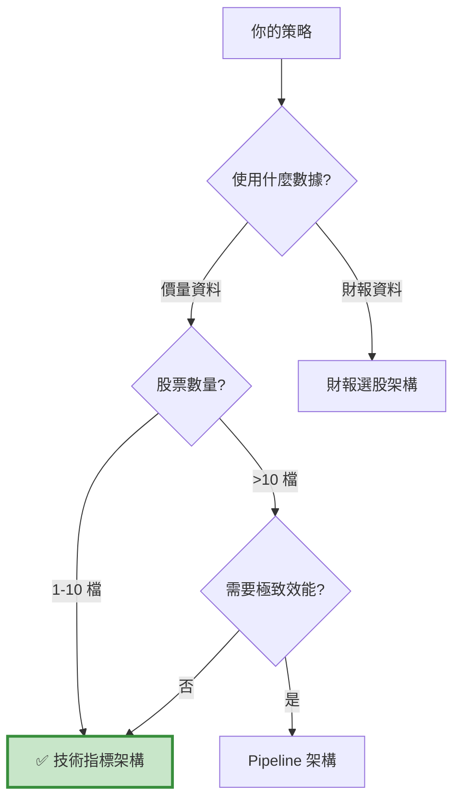

# 技術指標架構 - 常見問題 FAQ

本頁整理使用技術指標架構時最常遇到的問題與解決方案。

---

## 📑 目錄

- [基礎概念](#basics)
- [數據處理](#data-process)
- [指標計算](#indicator_cal)
- [訊號判斷](#signal)
- [交易執行](#trade_excution)
- [除錯技巧](#debug)            
- [效能優化](#optimize)         
- [實務應用](#practice)

---

## 基礎概念 {: #basics }

### Q1: 技術指標架構 vs 財報選股架構，我該選哪個？

**決策樹：**


**快速判斷：**

- ✅ 用技術指標：MACD、KD、RSI、均線等技術分析
- ✅ 用財報選股：本益比、ROE、負債比等基本面
- ✅ 用 Pipeline：大規模股票池 + 自定義因子

---

### Q2: 為什麼技術指標架構只適合少數股票？

**原因：Loop 方法的效能瓶頸**
```python
# 每天都要執行這段程式
for stock in stock_list:  # 假設有 100 檔
    history = data.history(stock, 'close', 50, '1d')  # 抓 50 天資料
    macd = calculate_macd(history)  # 計算指標
    # ... 判斷訊號 ...
# 100 檔 × 每天 = 非常慢！
```

**效能對比：**

| 股票數 | 技術指標架構 | Pipeline 架構 |
| :--- | :---: | :---: |
| 1 檔 | 🟢 快（0.1 秒/日） | 🟡 中（0.5 秒/日） |
| 10 檔 | 🟡 中（1 秒/日） | 🟢 快（0.6 秒/日） |
| 50 檔 | 🔴 慢（5 秒/日） | 🟢 快（1 秒/日） |
| 100 檔 | 🔴 超慢（10 秒/日） | 🟢 快（1.5 秒/日） |

**建議：**

- 1-10 檔：技術指標架構
- 10-50 檔：視情況選擇
- 50+ 檔：Pipeline 架構

---

### Q3: 什麼是「前視偏差」？技術指標策略怎麼避免？

**前視偏差的定義：**

使用「未來資料」做決策，導致回測結果過度樂觀。

**常見錯誤：**
```python
# ❌ 錯誤示範：用今天的指標，今天就下單
def handle_data(context, data):
    # 這裡的 history 「不包含」今天的收盤價
    trailing_window = data.history(stock, 'close', 20, '1d')
    macd = calculate_macd(trailing_window)
    
    # 但是！如果你這樣寫：
    current_macd = macd[-1]  # 這是「昨天」的 MACD
    
    if current_macd > 0:
        order(stock, 100)  # 今天下單
    # 這是對的！用昨天的指標，今天下單
```

**正確做法：**
```python
# ✅ 正確：用昨天的指標判斷，今天下單
if (macd[-2] < 0) and (macd[-1] > 0):  # 昨天 < 0，今天 > 0
    order(stock, 100)  # 今天下單

# 或者明確說明
yesterday_macd = macd[-2]
today_macd = macd[-1]

if (yesterday_macd < 0) and (today_macd > 0):
    order(stock, 100)
```

**關鍵理解：**

- `data.history()` **不包含當天** 的收盤價
- `macd[-1]` 是 **最新可用** 的值（通常是昨天）
- `macd[-2]` 是 **前一天** 的值（通常是前天）

---

## 數據處理 {: #data-process }

### Q4: data.history() 回傳的資料是什麼格式？

**回傳格式：pandas Series**
```python
trailing_window = data.history(symbol('2330'), 'close', 20, '1d')

print(type(trailing_window))
# <class 'pandas.core.series.Series'>

print(trailing_window)
# 2023-01-01    500.0
# 2023-01-02    505.0
# ...
# 2023-01-20    550.0
# Name: Equity(2330 [2330]), Length: 20, dtype: float64
```

**常用操作：**
```python
# 轉換為 numpy array（talib 需要）
close_array = trailing_window.values

# 取最新值
latest = trailing_window.iloc[-1]  # 或 trailing_window[-1]

# 取前一天
previous = trailing_window.iloc[-2]

# 計算變化率
pct_change = trailing_window.pct_change()
```

---

### Q5: 為什麼 data.history() 有時候回傳 NaN？

**常見原因：**

**原因 1：資料不足（回測初期）**
```python
# 回測第一天
def handle_data(context, data):
    trailing_window = data.history(stock, 'close', 50, '1d')
    # 如果回測才第 10 天，只有 10 筆資料
    # 其他 40 筆會是 NaN
```

**解決方案：**
```python
# 方法 1: 檢查 NaN
if trailing_window.isnull().values.any():
    return  # 跳過這一天

# 方法 2: 設定最小資料量
if len(trailing_window.dropna()) < 50:
    return
```

**原因 2：股票停牌**
```python
# 某天股票停牌，沒有交易資料
# 該天會是 NaN
```

**解決方案：**
```python
# 使用前向填充
trailing_window = trailing_window.fillna(method='ffill')

# 或直接刪除 NaN
trailing_window = trailing_window.dropna()
```

**原因 3：股票剛上市**
```python
# 新上市股票歷史資料不足
```

**解決方案：**
```python
# 在回測前過濾掉新股
def initialize(context):
    # 只交易上市超過 1 年的股票
    context.stocks = [s for s in stock_list if has_enough_history(s)]
```

---

### Q6: 如何抓取多個欄位的資料？

**方法 1：分別抓取**
```python
close = data.history(stock, 'close', 20, '1d')
volume = data.history(stock, 'volume', 20, '1d')
high = data.history(stock, 'high', 20, '1d')
low = data.history(stock, 'low', 20, '1d')
```

**方法 2：一次抓取（推薦）**
```python
# 抓取多個欄位
bars = data.history(
    stock,
    ['open', 'high', 'low', 'close', 'volume'],
    20,
    '1d'
)

# bars 是 DataFrame
print(type(bars))  # <class 'pandas.core.frame.DataFrame'>

# 取得各欄位
close = bars['close']
volume = bars['volume']
high = bars['high']
low = bars['low']
```

**效能比較：**
```python
# 慢（5 次 API 調用）
close = data.history(stock, 'close', 20, '1d')
volume = data.history(stock, 'volume', 20, '1d')
high = data.history(stock, 'high', 20, '1d')
low = data.history(stock, 'low', 20, '1d')
open_ = data.history(stock, 'open', 20, '1d')

# 快（1 次 API 調用）
bars = data.history(stock, ['open', 'high', 'low', 'close', 'volume'], 20, '1d')
```

---

## 指標計算 {: #indicator_cal }

### Q7: talib 計算的結果跟我手算不一樣？

**常見原因：EMA 初始值不同**
```python
# talib 的 EMA 初始值是用 SMA
ema = talib.EMA(close, timeperiod=12)

# 手算可能直接用第一筆資料
# 導致前面幾筆差異較大
```

**驗證方法：**
```python
import talib
import pandas as pd

close = pd.Series([100, 102, 101, 103, 105])

# talib 計算
ema_talib = talib.EMA(close.values, timeperiod=3)
print("talib:", ema_talib)

# pandas 計算
ema_pandas = close.ewm(span=3, adjust=False).mean()
print("pandas:", ema_pandas.values)

# 前面幾筆會有差異，後面會收斂
```

**建議：**

- 使用 talib 計算（業界標準）
- 忽略前面幾筆資料（warm-up period）
- 或等資料足夠後再開始交易

---

### Q8: 如何自己計算技術指標（不用 talib）？

**範例 1：簡單移動平均（SMA）**
```python
def calculate_sma(prices, period):
    """計算簡單移動平均"""
    return prices.rolling(window=period).mean()

# 使用
close = data.history(stock, 'close', 50, '1d')
sma20 = calculate_sma(close, 20)
```

**範例 2：指數移動平均（EMA）**
```python
def calculate_ema(prices, period):
    """計算指數移動平均"""
    return prices.ewm(span=period, adjust=False).mean()

# 使用
ema12 = calculate_ema(close, 12)
```

**範例 3：MACD**
```python
def calculate_macd(prices, fast=12, slow=26, signal=9):
    """計算 MACD"""
    ema_fast = prices.ewm(span=fast, adjust=False).mean()
    ema_slow = prices.ewm(span=slow, adjust=False).mean()
    
    dif = ema_fast - ema_slow
    macd = dif.ewm(span=signal, adjust=False).mean()
    histogram = dif - macd
    
    return dif, macd, histogram

# 使用
dif, macd, hist = calculate_macd(close)
```

**範例 4：RSI**
```python
def calculate_rsi(prices, period=14):
    """計算 RSI"""
    delta = prices.diff()
    
    gain = delta.where(delta > 0, 0)
    loss = -delta.where(delta < 0, 0)
    
    avg_gain = gain.rolling(window=period).mean()
    avg_loss = loss.rolling(window=period).mean()
    
    rs = avg_gain / avg_loss
    rsi = 100 - (100 / (1 + rs))
    
    return rsi

# 使用
rsi = calculate_rsi(close)
```

---

### Q9: 計算指標時遇到除以零的錯誤？

**常見情境：**
```python
# 計算 RSI
avg_loss = loss.rolling(window=14).mean()
rs = avg_gain / avg_loss  # 如果 avg_loss = 0 會出錯
```

**解決方案：**
```python
# 方法 1: 加上小數避免除以零
rs = avg_gain / (avg_loss + 1e-10)

# 方法 2: 使用 numpy.where
import numpy as np
rs = np.where(avg_loss == 0, 0, avg_gain / avg_loss)

# 方法 3: 用 pandas 的 replace
avg_loss = avg_loss.replace(0, np.nan)
rs = avg_gain / avg_loss
```

---

## 訊號判斷 {: #signal }

### Q10: 如何判斷「交叉」訊號？

**黃金交叉（向上穿越）：**
```python
# DIF 向上穿越 MACD
golden_cross = (dif[-2] < macd[-2]) and (dif[-1] > macd[-1])

# 或使用 pandas
golden_cross = (dif.shift(1) < macd.shift(1)) & (dif > macd)
```

**死亡交叉（向下穿越）：**
```python
# DIF 向下穿越 MACD
death_cross = (dif[-2] > macd[-2]) and (dif[-1] < macd[-1])
```

**注意事項：**
```python
# ❌ 錯誤：只檢查當前關係
if dif[-1] > macd[-1]:
    buy = True  # 這不是交叉！只是 DIF 在 MACD 上方

# ✅ 正確：檢查「穿越」動作
if (dif[-2] <= macd[-2]) and (dif[-1] > macd[-1]):
    buy = True  # 這才是交叉
```

---

### Q11: 如何避免「假訊號」？

**方法 1：雙重確認**
```python
# MACD 策略：DIF 穿越 MACD + 柱狀圖轉正
golden_cross = (dif[-2] < macd[-2]) and (dif[-1] > macd[-1])
histogram_turn_positive = (bar[-2] < 0) and (bar[-1] > 0)

if golden_cross and histogram_turn_positive:
    buy = True
```

**方法 2：加入過濾器**
```python
# 只在長期趨勢向上時買入
ma200 = data.history(stock, 'close', 200, '1d').mean()
current_price = data.current(stock, 'price')

if (macd_signal) and (current_price > ma200):
    buy = True
```

**方法 3：設定冷卻期**
```python
def initialize(context):
    context.last_trade_day = 0

def handle_data(context, data):
    if buy_signal:
        # 距離上次交易至少 5 天
        if context.i - context.last_trade_day >= 5:
            order(stock, 100)
            context.last_trade_day = context.i
```

**方法 4：確認力道**
```python
# 成交量確認
volume = data.current(stock, 'volume')
avg_volume = data.history(stock, 'volume', 20, '1d').mean()

if (buy_signal) and (volume > avg_volume * 1.5):
    buy = True  # 量價齊揚
```

---

### Q12: 多個指標怎麼組合？

**方法 1：全部同意（AND）**
```python
# MACD + RSI + 均線
macd_buy = (dif[-1] > macd[-1])
rsi_ok = (rsi[-1] > 30) and (rsi[-1] < 70)
ma_ok = (current_price > ma20)

if macd_buy and rsi_ok and ma_ok:
    buy = True
```

**方法 2：任一同意（OR）**
```python
# MACD 或 RSI 任一給出訊號
macd_buy = (dif[-1] > macd[-1])
rsi_buy = (rsi[-1] < 30)

if macd_buy or rsi_buy:
    buy = True
```

**方法 3：計分制**
```python
score = 0

if dif[-1] > macd[-1]:
    score += 2  # MACD 給 2 分

if rsi[-1] > 50:
    score += 1  # RSI 給 1 分

if current_price > ma20:
    score += 1  # 均線給 1 分

if score >= 3:  # 至少 3 分
    buy = True
```

**方法 4：階層式判斷**
```python
# 先看趨勢，再看指標
if current_price > ma60:  # 長期多頭
    if dif[-1] > macd[-1]:  # MACD 買入
        if rsi[-1] < 70:  # RSI 未超買
            buy = True
```

---

## 交易執行 {: #trade_excution }

### Q13: order、order_target、order_target_percent 有什麼差別？

**order：買入固定股數**
```python
order(stock, 100)   # 買入 100 股
order(stock, -100)  # 賣出 100 股
```

**order_target：調整到目標股數**
```python
# 假設目前持有 50 股
order_target(stock, 100)  # 會再買 50 股（調整到 100 股）
order_target(stock, 0)    # 會賣 50 股（調整到 0 股）
```

**order_target_percent：調整到目標比例**
```python
# 假設投資組合價值 1,000,000 元
order_target_percent(stock, 0.1)  # 該股持倉佔 10%（100,000 元）
order_target_percent(stock, 0)    # 清空該股
```

**使用情境：**
```python
# 情境 1：固定股數策略
if buy_signal:
    order(stock, 1000)  # 每次買 1000 股

# 情境 2：全有或全無
if buy_signal:
    order_target_percent(stock, 1.0)  # 全倉
elif sell_signal:
    order_target(stock, 0)  # 清空

# 情境 3：多檔等權重
stocks = [stock1, stock2, stock3]
for s in stocks:
    order_target_percent(s, 1.0 / len(stocks))  # 各 33.3%
```

---

### Q14: 如何實現「停損停利」？

**方法 1：固定百分比**
```python
def initialize(context):
    context.buy_price = {}

def handle_data(context, data):
    current_price = data.current(stock, 'price')
    
    # 買入時記錄價格
    if buy_signal:
        order(stock, 1000)
        context.buy_price[stock] = current_price
    
    # 停損：虧損 10%
    if stock in context.buy_price:
        if current_price < context.buy_price[stock] * 0.9:
            order_target(stock, 0)
            print(f"停損出場: {current_price}")
    
    # 停利：獲利 20%
    if stock in context.buy_price:
        if current_price > context.buy_price[stock] * 1.2:
            order_target(stock, 0)
            print(f"停利出場: {current_price}")
```

**方法 2：ATR 停損**
```python
# 使用 ATR（Average True Range）動態調整
atr = talib.ATR(high.values, low.values, close.values, timeperiod=14)

# 停損距離 = 2 倍 ATR
stop_loss = context.buy_price[stock] - (atr[-1] * 2)

if current_price < stop_loss:
    order_target(stock, 0)
```

**方法 3：追蹤停損**
```python
def initialize(context):
    context.highest_price = {}

def handle_data(context, data):
    current_price = data.current(stock, 'price')
    
    # 更新最高價
    if stock in context.highest_price:
        context.highest_price[stock] = max(
            context.highest_price[stock],
            current_price
        )
    else:
        context.highest_price[stock] = current_price
    
    # 從最高點回落 15% 停損
    if current_price < context.highest_price[stock] * 0.85:
        order_target(stock, 0)
        print(f"追蹤停損: {current_price}")
```

---

### Q15: 如何避免「過度交易」？

**問題：訊號太頻繁**
```python
# 可能每天都有訊號
if macd[-1] > 0:
    order(stock, 100)  # 每天都買
```

**解決方案 1：冷卻期**
```python
def initialize(context):
    context.last_trade_day = 0
    context.cooldown = 5  # 冷卻 5 天

def handle_data(context, data):
    if buy_signal:
        if context.i - context.last_trade_day >= context.cooldown:
            order(stock, 100)
            context.last_trade_day = context.i
```

**解決方案 2：訊號強度過濾**
```python
# 只在訊號「夠強」時交易
if (dif[-1] - macd[-1]) > threshold:  # DIF 要明顯大於 MACD
    buy = True
```

**解決方案 3：狀態機**
```python
def initialize(context):
    context.state = 'WAIT'  # WAIT, LONG, SHORT

def handle_data(context, data):
    if context.state == 'WAIT':
        if buy_signal:
            order(stock, 1000)
            context.state = 'LONG'
    
    elif context.state == 'LONG':
        if sell_signal:
            order_target(stock, 0)
            context.state = 'WAIT'
        # 持有期間不會重複買入
```

---

## 除錯技巧 {: #debug }

### Q16: 如何快速找到策略問題？

**分層除錯法：**

**Step 1：測試指標計算**
```python
# 單獨測試指標
import talib

close = [100, 102, 101, 103, 105, 104, 106, 108]
ema = talib.EMA(close, timeperiod=5)
print(ema)  # 確認計算正確
```

**Step 2：測試訊號判斷**
```python
def handle_data(context, data):
    # 印出關鍵變數
    print(f"日期: {data.current_dt.date()}")
    print(f"DIF: {dif[-1]:.2f}, MACD: {macd[-1]:.2f}")
    print(f"買入訊號: {buy}, 賣出訊號: {sell}")
    
    # 檢查邏輯
    if buy:
        print("  → 執行買入")
    elif sell:
        print("  → 執行賣出")
```

**Step 3：短期回測**
```python
# 只回測 1 個月
results = run_algorithm(
    start=pd.Timestamp('2023-01-01', tz='utc'),
    end=pd.Timestamp('2023-02-01', tz='utc'),  # 只跑 1 個月
    ...
)
```

**Step 4：視覺化檢查**
```python
# 在 analyze 中繪製圖表
def analyze(context, perf):
    # 檢查買賣點位置
    plt.plot(perf.index, perf['price'])
    buy_signals = perf[perf['buy'] == True]
    plt.scatter(buy_signals.index, buy_signals['price'], color='green')
    plt.show()
```

---

### Q17: 常見錯誤訊息及解決方法

**錯誤 1: `AttributeError: 'Series' object has no attribute 'values'`**
```python
# 原因：pandas 版本問題
# 解決：
close_array = trailing_window.to_numpy()  # 新版
# 或
close_array = trailing_window.values      # 舊版
```

**錯誤 2: `ValueError: operands could not be broadcast together`**
```python
# 原因：陣列長度不一致
ema12 = talib.EMA(close, timeperiod=12)  # 長度 N
ema26 = talib.EMA(close, timeperiod=26)  # 長度 N
dif = ema12 - ema26  # 可以相減

# 但如果：
close_short = close[-10:]  # 長度 10
close_long = close         # 長度 N
# 不能相減！

# 解決：確保長度一致
```

**錯誤 3: `KeyError: Equity(XXX) does not exist`**
```python
# 原因：股票不在 bundle 中
# 解決：
# 1. 確認 ingest 時有包含該股票
# 2. 確認日期範圍正確
# 3. 確認股票代碼正確
```

**錯誤 4: `IndexError: index -1 is out of bounds`**
```python
# 原因：陣列為空
# 解決：先檢查長度
if len(trailing_window) > 0:
    latest = trailing_window[-1]
```

---

## 效能優化 {: #optimize }

### Q18: 回測速度太慢怎麼辦？

**優化技巧 1：減少 history 調用**
```python
# ❌ 慢：多次調用
close = data.history(stock, 'close', 20, '1d')
volume = data.history(stock, 'volume', 20, '1d')
high = data.history(stock, 'high', 20, '1d')

# ✅ 快：一次調用
bars = data.history(stock, ['close', 'volume', 'high'], 20, '1d')
close = bars['close']
volume = bars['volume']
high = bars['high']
```

**優化技巧 2：快取計算結果**
```python
def initialize(context):
    context.indicator_cache = {}

def handle_data(context, data):
    current_date = data.current_dt.date()
    
    # 檢查快取
    if current_date in context.indicator_cache:
        macd = context.indicator_cache[current_date]
    else:
        # 計算並快取
        macd = calculate_macd(...)
        context.indicator_cache[current_date] = macd
```

**優化技巧 3：減少視覺化**
```python
# 回測時關閉視覺化
results = run_algorithm(
    ...
    # analyze=analyze  # 註解掉
)
```

**優化技巧 4：縮短回測期間**
```python
# 開發時用短期測試
start = '2023-01-01'
end = '2023-03-31'  # 只測 3 個月

# 確認邏輯正確後再跑完整期間
```

---

## 實務應用 {: #practice }

### Q19: 如何把回測策略部署到實盤？

**步驟：**

**Step 1：建立選股腳本**
```python
# daily_signal.py
import pandas as pd
import talib
from get_data import get_latest_prices  # 自定義函數

def generate_signal(ticker):
    """產生交易訊號"""
    # 抓取最新價格
    close = get_latest_prices(ticker, days=50)
    
    # 計算 MACD
    dif, macd, hist = talib.MACD(close)
    
    # 判斷訊號
    if (dif[-2] < macd[-2]) and (dif[-1] > macd[-1]):
        return 'BUY'
    elif (dif[-2] > macd[-2]) and (dif[-1] < macd[-1]):
        return 'SELL'
    else:
        return 'HOLD'

# 每日執行
signal = generate_signal('2330')
print(f"今日訊號: {signal}")
```

**Step 2：建立排程**
```python
# 使用 schedule 排程
import schedule
import time

def job():
    signal = generate_signal('2330')
    if signal == 'BUY':
        # 發送通知或自動下單
        send_notification(f"買入訊號：2330")

# 每天下午 1:30 執行
schedule.every().day.at("13:30").do(job)

while True:
    schedule.run_pending()
    time.sleep(60)
```

**Step 3：風險控管**
```python
def execute_with_safety(ticker, action, quantity):
    """安全執行交易"""
    # 檢查 1：帳戶餘額
    if action == 'BUY' and get_cash() < get_price(ticker) * quantity:
        print("現金不足")
        return False
    
    # 檢查 2：單一部位限制
    if get_position_value(ticker) / get_portfolio_value() > 0.3:
        print("單一部位過大")
        return False
    
    # 執行交易
    broker_api.order(ticker, action, quantity)
    return True
```

---

### Q20: 如何評估策略是否過度擬合？

**檢驗方法：**

**方法 1：樣本外測試**
```python
# 訓練期：2018-2020
train_results = run_algorithm(
    start=pd.Timestamp('2018-01-01', tz='utc'),
    end=pd.Timestamp('2020-12-31', tz='utc'),
    ...
)

# 測試期：2021-2023
test_results = run_algorithm(
    start=pd.Timestamp('2021-01-01', tz='utc'),
    end=pd.Timestamp('2023-12-31', tz='utc'),
    ...
)

# 比較績效
print(f"訓練期夏普: {train_results['sharpe'].iloc[-1]:.2f}")
print(f"測試期夏普: {test_results['sharpe'].iloc[-1]:.2f}")

# 如果測試期明顯變差 → 過擬合
```

**方法 2：參數敏感度分析**
```python
# 測試參數變化的影響
results = {}

for fast in [10, 12, 14]:
    for slow in [24, 26, 28]:
        sharpe = backtest_macd(fast, slow)
        results[(fast, slow)] = sharpe

# 檢查穩定性
print(results)
# 如果小幅調整參數就大幅影響績效 → 過擬合
```

**方法 3：不同市況測試**
```python
# 牛市期間
bull_results = backtest('2019-01-01', '2020-02-01')

# 熊市期間
bear_results = backtest('2020-03-01', '2020-06-01')

# 盤整期間
sideways_results = backtest('2021-01-01', '2021-12-31')

# 策略應該在不同市況都有一定表現
```

**方法 4：多檔股票測試**
```python
# 測試不同股票
stocks = ['2330', '2317', '2454', '2881', '2412']
results = {}

for stock in stocks:
    sharpe = backtest_strategy(stock)
    results[stock] = sharpe

# 如果只在某一檔表現好 → 可能過擬合
```

---

## 💡 最佳實踐總結

### ✅ DO（建議做）

1. **先測試小範圍**：1 天 → 1 週 → 1 個月 → 全期間
2. **檢查資料完整性**：使用 `isnull()` 檢查 NaN
3. **避免前視偏差**：使用 `[-2]` 和 `[-1]` 判斷交叉
4. **加入過濾機制**：避免假訊號和過度交易
5. **記錄關鍵變數**：用 `record()` 記錄指標值
6. **樣本外測試**：訓練期 + 測試期分離
7. **參數敏感度測試**：確保穩定性
8. **視覺化檢查**：用圖表檢查買賣點

### ❌ DON'T（避免做）

1. **不要過度優化參數**：調到小數點第三位
2. **不要忽略交易成本**：假設零成本
3. **不要只看報酬率**：忽略風險、回撤
4. **不要用未來資料**：避免前視偏差
5. **不要過度交易**：每天都買賣
6. **不要單一指標**：沒有過濾機制
7. **不要忽略 NaN**：直接計算會出錯
8. **不要跳過除錯**：直接全期回測

---

## 🔗 相關資源

- **架構說明**：[index.md](index.md)
- **Code 模板**：[template.md](template.md)
- **案例學習**：
  - [MACD 策略](case-macd.md)
  - [乖離率策略](case-bias.md)
  - [布林通道策略](case-bollinger.md)

---

**還有問題？**

如果這裡沒有涵蓋你的問題，請：

1. 檢查 [template.md](template.md) 的註解
2. 參考三個 case study 的實作
3. 回到 [overview.md](../overview.md) 確認是否選對架構

**👉 準備好了？** 前往 [template.md](template.md) 開始開發你的策略！