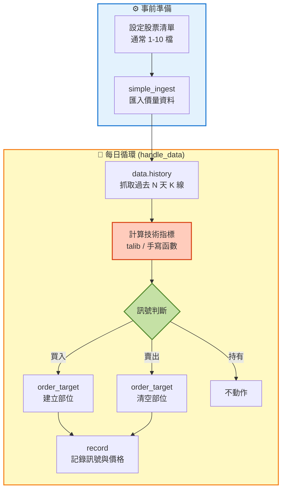
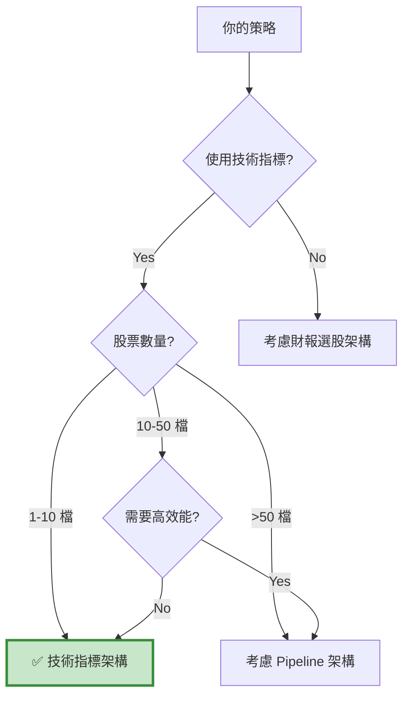

# 架構 B：技術指標架構 (Technical Indicator Framework)

> **核心思想：每日即時運算，靈活應對市場。**  
> "Calculate on-the-fly, react to the market."

---

## 📌 核心概念

技術指標架構的本質是「**即時運算 + 動態調整**」的回測模式：
```
每個交易日：
Step 1: 抓取過去 N 天的 K 線資料
Step 2: 計算技術指標（MACD、KD、布林通道等）
Step 3: 判斷訊號（買入 / 賣出 / 持有）
Step 4: 執行交易
```

這種架構最符合技術分析的思維邏輯：

- 📈 **盤中**：看著 K 線圖，計算指標
- 🎯 **即時**：出現訊號就下單
- 🔄 **每日**：持續監控，動態調整

---

## 🎯 適用場景

### ✅ 最適合的情境
- **技術指標交易**：MACD、KD、RSI、布林通道等
- **價量分析**：成交量、均線、支撐壓力
- **單一或少數標的**：1-10 檔股票
- **高頻調整**：日內、隔日、週度交易

### ❌ 不適合的情境
- ❌ 大規模股票池（>50 檔）
- ❌ 財報選股策略
- ❌ 需要外部數據（籌碼、財報）
- ❌ 低頻策略（季度調倉）

---

## 🏗️ 架構特色

### 數據流向圖


### 關鍵設計理念

#### 1. 即時運算的優勢
```python
# 每天即時抓 K 線，計算最新指標
def handle_data(context, data):
    # 抓取過去 35 天的收盤價
    trailing_window = data.history(context.sym, 'price', 35, '1d')
    
    # 計算 MACD
    short_ema = talib.EMA(trailing_window.values, timeperiod=12)
    long_ema = talib.EMA(trailing_window.values, timeperiod=26)
    dif = short_ema - long_ema
    macd = talib.EMA(dif, timeperiod=9)
    
    # 判斷訊號
    if (dif[-1] > macd[-1]) and (dif[-2] <= macd[-2]):
        order_target(context.sym, 1000)  # 黃金交叉，買入
```

**優點：**
- ✅ 參數調整容易（直接改 timeperiod）
- ✅ 邏輯清晰（與手動看盤一致）
- ✅ 除錯方便（可印出每日指標值）

#### 2. Pipeline vs Loop 的抉擇

| 特性 | Loop 方法（handle_data） | Pipeline 方法 |
| :--- | :---: | :---: |
| **適用股票數** | 1-10 檔 | 50+ 檔 |
| **彈性** | 🟢 極高 | 🔴 低 |
| **效能** | 🟡 中 | 🟢 高 |
| **學習曲線** | 🟢 平緩 | 🔴 陡峭 |
| **Debug 難度** | 🟢 易 | 🔴 難 |

**本架構採用 Loop 方法**，因為技術指標策略通常：
- 標的少（1-10 檔）
- 邏輯複雜（需要多條件判斷）
- 需要靈活調整

#### 3. 使用 talib 計算指標
```python
import talib

# 常用指標
ema = talib.EMA(close, timeperiod=20)
sma = talib.SMA(close, timeperiod=20)
macd, signal, hist = talib.MACD(close, fastperiod=12, slowperiod=26, signalperiod=9)
rsi = talib.RSI(close, timeperiod=14)
upper, middle, lower = talib.BBANDS(close, timeperiod=20, nbdevup=2, nbdevdn=2)
```

**為什麼用 talib？**
- ✅ 業界標準，計算正確
- ✅ 效能優異（C 語言實作）
- ✅ 涵蓋 150+ 技術指標

---

## 📊 與其他架構的差異

| 特性 | 技術指標架構 | 財報選股架構 | Pipeline 架構 |
| :--- | :---: | :---: | :---: |
| **運算時機** | 回測內（每日） | 回測外 | 回測內（盤前） |
| **數據來源** | data.history() | TEJ API | CustomDataset |
| **適用股票數** | 1-10 | 50-200 | 500-2000 |
| **調倉頻率** | 每日 | 季度/月度 | 每日/每週 |
| **典型用途** | 技術分析 | 基本面選股 | 因子模型 |
| **學習難度** | 🟢 易 | 🟢 易 | 🔴 難 |
| **彈性** | 🟢 極高 | 🟡 中 | 🔴 低 |

---

## 💡 何時選擇這個架構？

### 快速判斷檢查表


### 典型使用案例
- ✅ 均線策略（金叉死叉）
- ✅ MACD 策略（DIF 與 MACD 交叉）
- ✅ 布林通道（突破上下軌）
- ✅ KD 指標（超買超賣）
- ✅ 乖離率（偏離均線）
- ✅ RSI（相對強弱）

---

## 🎓 學習路徑

### 新手入門（3 步驟）
1. **閱讀案例**：先看 `case-macd.md`，理解完整流程
2. **複製模板**：前往 `template.md` 複製骨架
3. **替換指標**：修改技術指標計算邏輯

### 進階優化
- 多指標組合（MACD + RSI）
- 動態參數調整
- 加入停損停利機制
- 部位管理（金字塔加碼）

---

## 🔍 架構優勢與限制

### 優勢 ✅

#### 1. 極致彈性
```python
# 可以輕鬆實現複雜邏輯
if (macd_signal == 'buy') and (rsi < 30) and (volume > avg_volume * 1.5):
    if context.portfolio.positions[stock].amount == 0:
        order(stock, 1000)
    elif current_price < buy_price * 0.95:  # 價格回檔
        order(stock, 500)  # 加碼
```

#### 2. Debug 友善
```python
# 可以隨時印出當前狀態
print(f"日期: {data.current_dt.date()}")
print(f"DIF: {dif[-1]:.2f}, MACD: {macd[-1]:.2f}")
print(f"訊號: {'買入' if buy else '賣出' if sell else '持有'}")
```

#### 3. 符合直覺
```python
# 與手動看盤邏輯一致
if current_price > upper_band:  # 突破上軌
    order_target(stock, 0)      # 賣出
```

### 限制 ⚠️

#### 1. 效能瓶頸
```python
# 如果有 100 檔股票
for stock in stock_list:  # 每天跑 100 次
    history = data.history(stock, 'price', 50, '1d')
    macd = calculate_macd(history)
    # ...
# 會非常慢！
```

**解決方案：**
- 限制股票數量（<10 檔）
- 或改用 Pipeline 架構

#### 2. 過度交易風險
```python
# 技術指標策略容易產生過多訊號
# 需要加入過濾機制
if buy_signal and (context.i - context.last_trade_day > 5):
    order(stock, 100)
    context.last_trade_day = context.i
```

#### 3. 參數敏感
```python
# MACD(12, 26, 9) 很好
# MACD(13, 27, 10) 可能很差
# 需要穩健性測試
for fast in range(10, 15):
    for slow in range(24, 30):
        test_backtest(fast, slow)
```

---

## 🛠️ 核心工具介紹

### 1. data.history() - 抓取歷史資料
```python
# 語法
data.history(
    assets,          # 股票代號（symbol 物件）
    fields,          # 欄位：'price', 'open', 'high', 'low', 'close', 'volume'
    bar_count,       # 數量（往回幾根 K 棒）
    frequency        # 頻率：'1d'（日線）, '1m'（分鐘線）
)

# 範例
close_prices = data.history(symbol('2330'), 'close', 20, '1d')
# 回傳：過去 20 天的收盤價（pandas Series）
```

**注意事項：**
- 回傳的資料**不包含當天**（避免前視偏差）
- 如果資料不足（如新上市股票），會回傳 NaN

### 2. talib - 技術指標計算
```python
import talib

# 移動平均
sma = talib.SMA(close, timeperiod=20)
ema = talib.EMA(close, timeperiod=20)

# 趨勢指標
macd, signal, hist = talib.MACD(close, fastperiod=12, slowperiod=26, signalperiod=9)

# 震盪指標
rsi = talib.RSI(close, timeperiod=14)
stoch_k, stoch_d = talib.STOCH(high, low, close, fastk_period=14, slowk_period=3, slowd_period=3)

# 通道指標
upper, middle, lower = talib.BBANDS(close, timeperiod=20, nbdevup=2, nbdevdn=2)

# 成交量指標
obv = talib.OBV(close, volume)
```

### 3. record() - 記錄變數
```python
# 記錄關鍵變數，用於後續分析
record(
    price=current_price,
    macd_dif=dif[-1],
    macd_signal=macd[-1],
    buy_signal=buy,
    sell_signal=sell
)

# 回測後可以從 results 取得
results['price'].plot()
results['macd_dif'].plot()
```

---

## ⚠️ 常見陷阱

### 陷阱 1：忘記檢查資料完整性
```python
# ❌ 錯誤
trailing_window = data.history(context.sym, 'price', 35, '1d')
ema = talib.EMA(trailing_window.values, timeperiod=12)

# ✅ 正確
trailing_window = data.history(context.sym, 'price', 35, '1d')
if trailing_window.isnull().values.any():
    return  # 資料不足，跳過
ema = talib.EMA(trailing_window.values, timeperiod=12)
```

### 陷阱 2：當天計算當天下單
```python
# ❌ 錯誤：用今天的指標做決策，今天就下單
def handle_data(context, data):
    macd = calculate_macd(data.history(...))
    if macd[-1] > 0:
        order(stock, 100)  # 這是用今天的 macd，今天下單！

# ✅ 正確：用昨天的指標判斷，今天下單
def handle_data(context, data):
    macd = calculate_macd(data.history(...))
    if (macd[-2] < 0) and (macd[-1] > 0):  # 昨天 < 0，今天 > 0
        order(stock, 100)  # 今天下單
```

### 陷阱 3：過度交易
```python
# ❌ 錯誤：每次訊號都交易
if macd_signal:
    order_target(stock, 1000)
# → 可能每天都在買賣

# ✅ 正確：加入冷卻期
if macd_signal and (context.i - context.last_trade > 5):
    order_target(stock, 1000)
    context.last_trade = context.i
```

---

## 📚 相關資源

- **模板頁面**：[template.md](template.md)
- **案例學習**：
  - [MACD 策略](case-macd.md) - 經典雙線交叉
  - [乖離率策略](case-bias.md) - 均線偏離度
  - [布林通道策略](case-bollinger.md) - 統計通道突破
- **常見問題**：[faq.md](faq.md)

---

## 💡 總結

技術指標架構適合：

- 📈 技術分析愛好者
- 🎯 少數標的交易（1-10 檔）
- ⚡ 需要靈活調整邏輯
- 🔄 日頻或週頻交易

**核心優勢：**

1. ✅ 邏輯直觀（與手動看盤一致）
2. ✅ 彈性極高（可實現任意複雜邏輯）
3. ✅ Debug 容易（隨時印出狀態）

**使用限制：**

1. ⚠️ 股票數量有限（<10 檔）
2. ⚠️ 需注意過度交易
3. ⚠️ 參數敏感性高

**👉 Next Step:** 前往 [template.md](template.md) 開始開發你的技術指標策略！