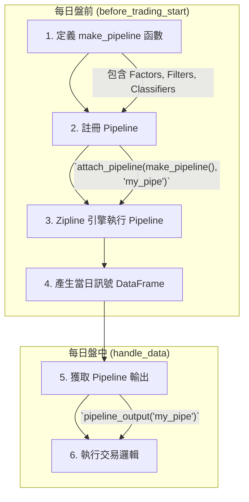

# Pipeline 投資訊號生成

!!! info
    本頁深入解釋 Zipline Pipeline 的運作原理，包括其核心組件（Factors, Filters, Classifiers）、資料集 (DataSets) 的概念、以及如何透過 Pipeline 高效地生成交易訊號，為使用者建立對 Pipeline 的全面理解。

Zipline Pipeline 是一個強大的 API，專為在大量的證券時間序列數據上進行高效計算而設計。在量化交易中，我們經常需要對整個市場的股票計算各種指標（如移動平均、波動率），並根據這些指標篩選出符合特定條件的股票池。如果使用傳統的 for-loop 逐一處理每隻股票，當股票數量龐大或計算複雜時，效率會非常低下。

Pipeline 的核心優勢在於它將所有計算 **向量化** (Vectorized)，利用底層優化的 `NumPy` 和 `Pandas` 運算，一次性地對所有資產進行橫截面計算，從从而極大地提升了運算效率。

## 1. Pipeline 簡介

您可以將 Pipeline 想像成一條處理證券數據的「管線」。數據從一端流入，經過管線中一系列的處理站（計算、篩選、分類），最終在另一端產出一個結構化的數據表 (DataFrame)，其中包含了您在當天交易所需要的所有資訊。

在 Zipline 策略中，Pipeline 的主要職責是在每個交易日開盤前，為 `handle_data` 函數準備好當日研究所需的數據，例如：

*   計算每隻股票的 20 日移動平均價。
*   篩選出當前市值排名前 10% 的股票。
*   標記出每隻股票所屬的產業類別。

---

## 2. Pipeline 的三大核心組件

Pipeline 主要由三種類型的組件構成，它們可以被靈活地組合，以構建複雜的數據處理邏輯。

### Factors (因子)

*   **作用**：計算一個數值。每個資產在每個時間點都會被賦予一個由 Factor 計算出的浮點數或整數。
*   **範例**：
    *   `SimpleMovingAverage(inputs=[TWEquityPricing.close], window_length=20)`：計算 20 日收盤價的移動平均。
    *   `Momentum(inputs=[TWEquityPricing.close], window_length=10)`：計算 10 日動量。
    *   `CustomFactor`：您可以繼承 `CustomFactor` 類別來創建自己的因子，實現任意複雜的計算邏輯。

### Filters (濾網)

*   **作用**：篩選出一組符合條件的資產。每個資產在每個時間點都會被賦予一個布林值 (True/False)。
*   **範例**：
    *   `SimpleMovingAverage(...) > 100`：篩選出 20 日均線大於 100 的股票。
    *   `MarketCap().top(100)`：篩選出市值排名前 100 的股票。
    *   `StaticAssets([...])`：篩選出一個靜態的股票列表。

### Classifiers (分類器)

*   **作用**：為資產進行分類。每個資產在每個時間點都會被賦予一個標籤（通常是字串或整數），用於分組。
*   **範例**：
    *   `Sector()`：返回每隻股票所屬的產業類別。
    > 詳見：[內建因子/濾網/分類器](../reference/pipeline/built-ins.md)

---

## 3. 資料集 (DataSets)

Pipeline 需要從一個定義好的資料集中獲取原始數據。TQuant Lab 提供了多種內建的資料集：

*   `TWEquityPricing`：提供台灣市場的股票價量資料，包括開、高、低、收、量 (`open`, `high`, `low`, `close`, `volume`)。
*   `TQDataSet` / `TQAltDataSet`：提供由 TEJ 整理的財務、非財務數據，例如 `Market_Cap_Dollars` (市值)、`PER` (本益比) 等。

> 詳見：[資料集 (概論)](../reference/pipeline/datasets/overview.md)

---

## 4. Pipeline 的運作流程

在一個典型的 Zipline 策略中，Pipeline 的運作流程如下：



1.  **定義 `make_pipeline()` 函數**：
    您需要創建一個名為 `make_pipeline()` 的函數，並在其中定義 Pipeline 的結構，包括要計算的 Factors、篩選的 Filters 等。

    ```python
    from zipline.pipeline import Pipeline
    from zipline.pipeline.factors import SimpleMovingAverage
    from zipline.pipeline.data import TWEquityPricing

    def make_pipeline():
        mean_close_20 = SimpleMovingAverage(inputs=[TWEquityPricing.close], window_length=20)
        
        return Pipeline(
            columns={
                'mean_close_20': mean_close_20
            },
            screen = (mean_close_20 > 10) # 僅計算均線大於 10 的股票
        )
    ```

2.  **在 `initialize` 中註冊 Pipeline**：
    使用 `attach_pipeline()` 函數將您定義的 `make_pipeline` 註冊到 Zipline 引擎中，並為其命名（例如 `'my_pipe'`）。

    ```python
    def initialize(context):
        attach_pipeline(make_pipeline(), 'my_pipe')
    ```

3.  **在 `handle_data` 中獲取結果**：
    在 `handle_data` 函數中，使用 `pipeline_output()` 並傳入您之前設定的名稱，即可獲取一個 Pandas DataFrame，其中包含了當天 Pipeline 計算和篩選後的結果。

    ```python
    def handle_data(context, data):
        pipe_results = pipeline_output('my_pipe')
        
        # pipe_results 是一個 DataFrame，包含了所有通過 screen 篩選的股票
        # 以及您在 columns 中定義的 'mean_close_20' 欄位
        for asset in pipe_results.index:
            mean_price = pipe_results.loc[asset, 'mean_close_20']
            # ... 執行您的交易邏輯 ...
    ```

---

## 5. 自訂因子 (CustomFactor)

當內建的因子無法滿足您的需求時，可以透過繼承 `CustomFactor` 類別來創建自己的因子。您只需要定義 `inputs`（需要哪些原始數據）和 `window_length`（需要多長的時間窗口），並實現 `compute` 方法來描述您的計算邏輯。

```python
from zipline.pipeline import CustomFactor
import numpy as np

class MyMomentum(CustomFactor):
    inputs = [TWEquityPricing.close]
    window_length = 10
    
    def compute(self, today, assets, out, close_prices):
        # close_prices 是一個 10xN 的 NumPy array
        # (window_length x number of assets)
        
        # 計算 10 日動量：(今日價格 / 10天前價格) - 1
        out[:] = (close_prices[-1] / close_prices[0]) - 1
```

> 詳見：[自訂因子](../reference/pipeline/custom-factor.md)

---

## 6. Pipeline 在策略中的使用

Pipeline 的設計旨在與 Zipline 的事件驅動回測框架無縫協作，為策略提供每日更新的交易訊號。

### 在 `handle_data` 中獲取 Pipeline 結果

如前所述，在 `handle_data(context, data)` 函數中，您可以透過 `pipeline_output('您的 Pipeline 名稱')` 來獲取 Pipeline 在當日計算出的結果。這個結果是一個 Pandas DataFrame，其索引為資產 (Asset)，欄位為您在 Pipeline 中定義的 Factors、Filters 或 Classifiers 的輸出。

```python
def handle_data(context, data):
    # 獲取 Pipeline 在當日計算出的結果
    current_signals = pipeline_output('my_pipeline_name')
    
    if current_signals is not None and not current_signals.empty:
        for asset_id, row in current_signals.iterrows():
            # 根據 Pipeline 產生的訊號執行交易邏輯
            # 例如：如果某個因子值達到閾值，則下單
            pass
```

### 執行時機與性能考量

Pipeline 的計算通常在每個交易日的 `before_trading_start()` 函數中執行，這確保了在 `handle_data()` 執行時，所有基於 Pipeline 的訊號都已準備就緒。這種設計將耗時的數據處理與交易決策分離，有助於提升回測效率。

*   **缺失資料處理**：
    Pipeline 在處理數據時會自動處理缺失值 (NaN)。您可以透過在 Pipeline 中使用 `Factor().fillna()` 或在 `handle_data` 中檢查 `current_signals` 是否為空或包含 NaN 值來進一步管理這些情況。

---

## 7. 常見陷阱與最佳實踐

為了充分利用 Pipeline 的強大功能並避免常見問題，請考慮以下幾點：

*   **避免在 `handle_data` 中重複計算因子**：
    Pipeline 的主要目的就是將因子計算從 `handle_data` 中分離出來並進行優化。在 `handle_data` 中直接進行複雜的歷史數據計算會導致嚴重的性能問題和潛在的向前看偏誤。

*   **理解 `window_length` 的含義**：
    `window_length` 參數定義了因子計算所需的歷史數據窗口。請確保您理解其計算方式（通常是包含當前日之前的 N 個交易日），以避免引入向前看偏誤。

*   **善用 `mask` 參數進行篩選**：
    在 Pipeline 中使用 `mask` 參數可以有效地限制計算範圍，只對您感興趣的資產進行因子計算，進一步提升效率。

*   **逐步構建複雜 Pipeline**：
    對於複雜的策略，建議從簡單的 Pipeline 開始，逐步添加 Factors、Filters 和 Classifiers，並在每個階段驗證輸出，以確保邏輯正確。

---

## 總結

Zipline Pipeline 是 TQuant Lab 中用於高效生成投資訊號的基石。透過理解其核心組件、資料集和運作流程，並遵循最佳實踐，您可以構建出強大、高效且可擴展的量化交易策略。熟練掌握 Pipeline 的使用，將極大地提升您的策略研究能力。

> 詳見：[內建因子/濾網/分類器](../reference/pipeline/built-ins.md)