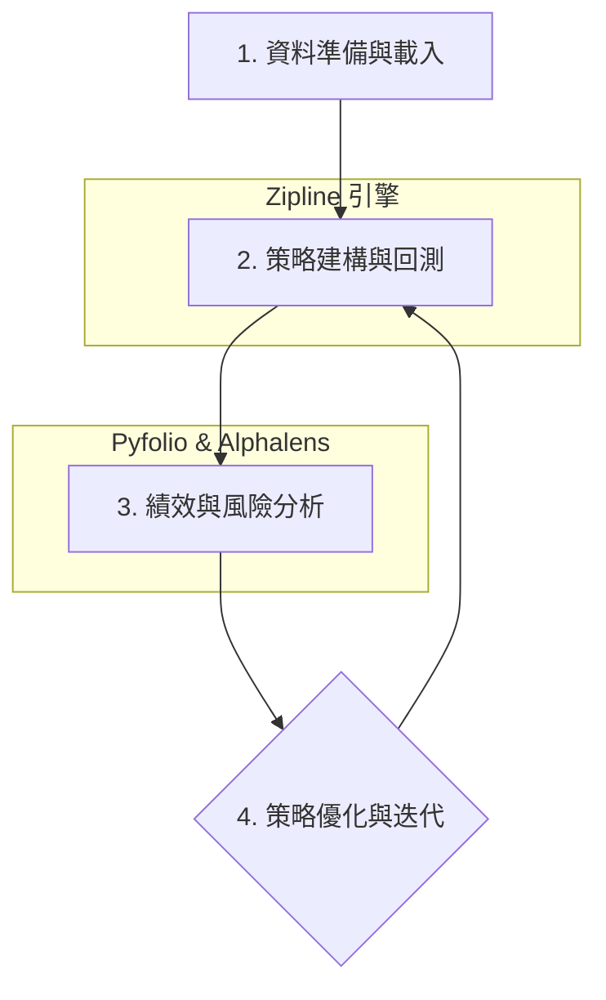

# TQuant Lab 分析流程

!!! info
    本頁宏觀地介紹 TQuant Lab 的核心分析流程，從資料獲取、策略發想、回測執行到績- 效分析，為使用者建立一個整體的概念框架。

TQuant Lab 承襲了 Quantopian 的核心架構，提供一個從策略研究、回測到績效分析的完整量化交易流程。整個工作流程可以被拆解為四大核心步驟，每個步驟環環相扣，構成一個高效的研究循環。

## 核心四大流程

---

### 1. 資料準備與載入 (Data Preparation)

在任何量化分析開始之前，首要任務是準備乾淨且準確的資料。TQuant Lab 透過 `zipline ingest` 指令將資料載入到 Zipline Bundle 中，供回測引擎使用。

*   **定義股票池 (`get_universe`)**：
    首先，您需要定義回測的標的範圍，例如台灣 50 指數成分股、特定產業類股，或是您自訂的股票列表。

*   **資料擷取 (`zipline ingest`)**：
    使用 `zipline ingest` 指令，TQuant Lab 會自動從 TEJ API 下載您所需的價量、基本面、或另類資料，並將其轉換為 Zipline 高效能的 bcolz 格式。這個過程確保了回測時能快速讀取數據。

*   **多資料類型支援**：
    除股票價量外，TQuant Lab 支援基本面資料、期貨、ETF 等。根據您的策略需求選擇對應的資料 bundle。

> 詳見：[如何 Ingest 股票價量資料](../../how-to/data/ingest-spot-pricing.md)

---

### 2. 策略建構與回測 (Strategy & Backtest)

這是量化研究的核心。您將在這裡把交易思想轉化為具體的程式碼，並在歷史資料上驗證其有效性。此階段主要在 Zipline 引擎中完成。

*   **Pipeline API - 訊號生成**：
    Pipeline 是一個強大的 API，用於高效地計算、過濾和篩選大量的證券資料。您可以透過組合內建或自訂的因子 (Factors)、濾網 (Filters) 和分類器 (Classifiers) 來產生每日的交易訊號。

*   **核心回測函數 (`initialize` & `handle_data`)**：
    *   `initialize(context)`：此函數在回測開始時 **僅執行一次** ，用於設定初始參數，例如初始資金、手續費/滑價模型、以及註冊 Pipeline。
    *   `handle_data(context, data)`：此函數是策略的心臟，它會在每個交易日 **盤中** 被調用。您將在此處獲取 Pipeline 的計算結果，並根據交易邏輯執行下單指令 (`order_target_percent`, `order`, etc.)。

*   **執行回測 (`run_algorithm`)**：
    設定好回測的起始/結束日期、初始資金等參數後，`run_algorithm` 函數將會啟動 Zipline 引擎，逐日模擬您的交易策略，並記錄下每日的投資組合狀態、交易紀錄等詳細資訊。

#### 進階概念：手續費與滑價模型
在實際交易中，手續費和滑價是重要的成本因子。透過 `set_commission()` 和 `set_slippage()` 函數，您可以精確模擬交易成本，使回測結果更貼近現實。

#### 進階概念：期貨與連續合約
對於期貨交易，TQuant Lab 提供了 `continuous_future()` API 來獲取連續合約物件，解決了期貨合約到期換月的複雜問題，讓您可以專注於策略邏輯本身。

> 詳見：[Zipline 引擎核心機制](./zipline-engine.md)

---

### 3. 績效與風險分析 (Performance & Risk Analysis)

回測完成後，會產出一個包含詳細交易歷史的 `results` DataFrame。接下來，您需要使用專業的工具來評估策略的表現。

*   **Pyfolio 視覺化報表**：
    Pyfolio 是 Quantopian 開發的專業績效分析套件。只需將 `results` 傳入 `pyfolio.create_full_tear_sheet` 函數，即可自動生成包含累計報酬、夏普比率 (Sharpe Ratio)、最大回撤 (Max Drawdown)、風險因子分析 (Alpha, Beta) 等數十種關鍵指標的視覺化報告。

*   **Alphalens 因子分析**：
    如果您想深入評估 Pipeline 中特定因子的有效性，Alphalens 可以幫助您分析因子的預測能力 (Information Coefficient)、報酬分佈、以及換手率等，從而判斷您的 Alpha 來源是否穩健。

> 詳見：[Pyfolio 績效分析概論](./pyfolio-overview.md)
> 詳見：[Alphalens 因子分析概論](./alphalens-overview.md)

---

### 4. 策略優化與迭代 (Optimization & Iteration)

量化研究是一個不斷迭代的過程。根據績效分析報告的結果，您可能會發現策略的不足之處，例如：

*   交易成本過高，需要調整換手率。
*   在特定市場風格下表現不佳，需要加入新的因子。
*   最大回撤過大，需要改進風險控制機制。

基於這些洞見，您可以回到**步驟 2**，調整您的 Pipeline 因子或 `handle_data` 中的交易邏輯，然後重新執行回測與分析，形成一個完整的研究閉環。

---

## 常見陷阱與最佳實踐

*   **向前看偏誤 (Look-ahead Bias)**：
    確保您的 Pipeline 因子或策略邏輯在做決策時，只使用了該時間點**之前**的歷史資料，避免意外使用到未來的資訊。

*   **過度優化 (Overfitting)**：
    避免在同一段歷史資料上反覆測試並調整參數。一個穩健的策略應該在樣本內 (In-Sample) 訓練後，在從未見過的樣本外 (Out-of-Sample) 資料上依然表現良好。

*   **滑價與成本忽視**：
    在回測中不設定或低估手續費與滑價，可能會導致過於樂觀的績效。一個貼近現實的成本模型是策略能否在實盤中獲利的關鍵。