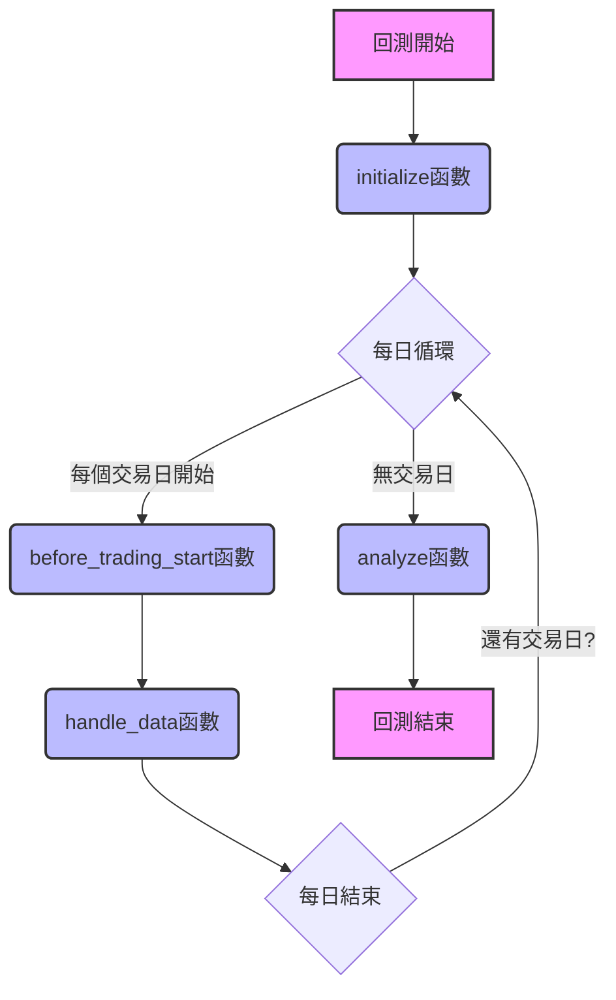

# Zipline 引擎核心機制

!!! info
    本頁深入解釋 Zipline 引擎的運作原理，包括其核心組件（如 `initialize`, `handle_data`, `before_trading_start`）、事件驅動模型、以及資料處理機制，為使用者建立對 Zipline 引擎的全面理解。

Zipline 是 TQuant Lab 的核心回測引擎，它提供了一個強大且靈活的框架，用於模擬股票、期貨等金融資產的交易策略。Zipline 的設計理念是 **事件驅動 (Event-Driven)** ，這意味著它會按照時間順序處理市場事件（如開盤、收盤、交易數據更新），並根據策略邏輯執行相應的操作。

## 1. Zipline 簡介

Zipline 是一個由 Quantopian 開源的 Python 函式庫，專為量化交易策略的回測而設計。它提供了一套完整的工具，讓研究者能夠：

*   **模擬真實市場環境** ：精確重現歷史市場數據，包括價格、成交量、交易成本等。
*   **快速開發策略** ：透過簡潔的 API 撰寫交易邏輯。
*   **高效執行回測** ：優化後的數據結構和事件處理機制，確保回測效率。
*   **整合分析工具** ：與 Pyfolio 等工具無縫整合，提供豐富的績效分析報告。

在 TQuant Lab 中，Zipline 引擎是所有策略回測的基石，負責處理資料流、執行交易指令、管理投資組合狀態，並最終產出詳細的回測結果。

---

## 2. 事件驅動模型

Zipline 的事件驅動模型是其核心特色。它不是簡單地遍歷時間序列數據，而是模擬市場中發生的各種事件，並在這些事件發生時觸發策略中定義的函數。這使得策略能夠對市場變化做出即時反應，更貼近真實交易。

---

## 3. 核心生命週期函數

Zipline 策略主要由以下幾個生命週期函數構成，它們在回測的不同階段被調用：

### 3.1. initialize(context)

*   **執行時機** ：在回測開始時 **僅執行一次** 。
*   **作用** ：用於設定策略的初始狀態和參數，例如：
    *   定義初始資金 (`context.capital_base`)。
    *   設定手續費 (`set_commission`) 和滑價 (`set_slippage`) 模型。
    *   註冊 Pipeline (`attach_pipeline`)。
    *   設定基準指數 (`set_benchmark`)。
    *   初始化策略所需的變數 (`context.my_variable = ...`)。

### 3.2. handle_data(context, data)

*   **執行時機** ：在每個交易日 **盤中** 被調用一次。對於日頻回測，通常在開盤後執行，並可獲取當日開盤後的最新數據。
*   **作用** ：這是策略的核心邏輯所在。您將在此處：
    *   獲取最新的市場數據 (`data.current()`, `data.history()`)。
    *   獲取 Pipeline 計算出的交易訊號 (`pipeline_output()`)。
    *   根據交易邏輯判斷買賣時機。
    *   執行下單操作 (`order`, `order_target_percent`)。
    *   記錄自訂指標 (`record`)。

### 3.3. before_trading_start(context, data) (可選)

*   **執行時機** ：在每個交易日 **開盤前** 被調用一次。
*   **作用** ：適用於需要在盤前進行資料預處理、計算或調整策略狀態的場景，例如：
    *   更新每日的股票池。
    *   計算盤前因子。
    *   調整策略的風險參數。

### 3.4. analyze(context, perf) (可選)

*   **執行時機** ：在整個回測結束時 **僅執行一次** 。
*   **作用** ：用於對回測結果進行最終分析和視覺化，例如：
    *   使用 Pyfolio 生成績效報告。
    *   繪製自訂的策略表現圖表。
    *   輸出最終的統計數據。

> 詳見：[生命週期函數](../../reference/zipline/lifecycle-functions.md)

---

## 4. context 物件：策略的記憶體

`context` 物件是 Zipline 策略中一個至關重要的概念，它在整個回測過程中持續存在，並在不同的生命週期函數之間傳遞策略的狀態和資訊。您可以將其視為策略的「記憶體」或「全局變數儲存庫」。

`context` 包含了多個重要的屬性，讓您可以存取投資組合、帳戶、訂單等即時資訊：

*   `context.portfolio`：包含投資組合的詳細資訊，如總資產價值 (`portfolio_value`)、現金餘額 (`cash`)、當前持倉 (`positions`) 等。
*   `context.account`：提供帳戶層級的資訊，如槓桿率 (`leverage`)、可用資金 (`buying_power`) 等。
*   `context.blotter`：記錄所有訂單和交易的資訊，包括未成交訂單 (`open_orders`)、已成交訂單 (`orders`) 等。
*   `context.sim_params`：包含回測的模擬參數，如起始/結束日期、初始資金 (`capital_base`)、資料頻率 (`data_frequency`) 等。
*   **自訂屬性** ：您可以在 `initialize` 函數中為 `context` 添加任何自訂屬性，以便在 `handle_data` 或其他函數中使用和更新，例如 `context.my_indicator = []`。

> 詳見：[context 變數](../../reference/zipline/context.md)

---

## 5. 資料處理機制

Zipline 提供了兩種主要方式來獲取市場數據：

*   **`data.history(asset, field, bar_count, frequency)`** ：
    用於獲取指定資產在過去一段時間內的歷史數據。例如，獲取某股票過去 100 天的收盤價。

*   **`data.current(asset, field)`** ：
    用於獲取指定資產在當前交易日（或當前模擬時間點）的最新數據。例如，獲取當前股票的最新價格或成交量。

*   **Pipeline 與資料整合** ：
    Pipeline API 能夠高效地處理大量歷史數據，計算出複雜的因子和交易訊號。這些訊號在 `handle_data` 中透過 `pipeline_output()` 函數被獲取，並用於驅動交易決策。

### 邊界情況處理 (Edge Case Handling)

在實際回測中，需要注意資料的完整性和各種可能發生的邊界情況：

*   **缺失資料 (NaN)** ：當 `data.history()` 或 `pipeline_output()` 返回 NaN 時，策略應有相應的處理邏輯，例如跳過該資產或使用前一天的數據。
*   **停牌或已下市資產** ：Zipline 會自動處理停牌或已下市的資產，避免在這些資產上執行交易。您也可以在策略中檢查 `data.is_lively()` 來確認資產是否可交易。
*   **現金不足** ：當嘗試下單的資金超過可用現金時，Zipline 會自動調整訂單數量或拒絕訂單。策略設計時應考慮資金管理，避免過度下單。

> 詳見：[Zipline 資料物件](../../reference/zipline/data-object.md)
> 詳見：[Pipeline API (概論)](../../reference/pipeline/overview.md)

---

## 6. 交易執行與部位管理

Zipline 提供了直觀的 API 來執行交易和管理投資組合：

*   **下單函數** ：
    *   `order(asset, amount)`：以市價單形式買入或賣出指定數量的資產。
    *   `order_target_percent(asset, percent)`：調整指定資產的持倉比例至目標百分比。Zipline 會自動計算需要買賣的數量。
    *   `order_target_value(asset, value)`：調整指定資產的持倉價值至目標金額。

*   **手續費與滑價模型** ：
    Zipline 允許您設定詳細的手續費 (`set_commission`) 和滑價 (`set_slippage`) 模型，以更真實地模擬交易成本對策略績效的影響。

*   **部位查詢** ：
    您可以隨時透過 `context.portfolio.positions` 查詢當前持有的所有資產及其詳細資訊（如數量、成本價、最新市價）。

> 詳見：[下單函數](../../reference/zipline/orders.md)

---

## 7. 交易執行模式與訂單管理

Zipline 不僅模擬交易行為，也處理訂單的生命週期，理解這些有助於策略的精確控制。

### 市價單 (Market Order) 與限價單 (Limit Order)

Zipline 預設以下單函數如 `order()` 發出 **市價單** ，根據回測頻率（日頻或分鐘頻）在下一個可用的條形數據點進行成交。您也可以使用 `order_target_value()` 或 `order_target_percent()` 來管理您的持倉比重。

### 訂單執行順序與優先級

在日頻回測中，所有 `handle_data` 中發出的訂單會被收集，並在當日收盤時以收盤價執行，考慮滑價和手續費。Zipline 內部會盡可能模擬真實市場中的訂單撮合邏輯。

### 未成交訂單的過夜處理

如果訂單在當天未能完全成交（例如，因為流動性不足或設定了限價），未成交的部分將會「過夜」並在下一個交易日繼續嘗試成交，直到訂單被完全成交、取消或達到預設的超時期限。在 `initialize` 或 `before_trading_start` 中，您可以透過 `context.blotter.open_orders` 檢查未成交訂單。

---

## 8. 效能與最佳實踐

為了高效地運行回測並獲得可靠的結果，遵循一些最佳實踐至關重要。

*   **在 `handle_data()` 中避免複雜計算** ：
    `handle_data()` 在每個交易日都會被呼叫，應盡量保持其輕量化。將大規模的數據處理和因子計算移至 Pipeline 中，或使用 `before_trading_start()` 進行盤前一次性計算，可以顯著提升回測速度。

*   **使用 Pipeline 而非 for-loop 進行大規模因子計算** ：
    Pipeline 專為處理多資產時間序列數據而優化，使用 C 語言底層實現，比 Python 的 for-loop 效率高出數個量級。對於涉及大量股票或複雜因子的計算，務必使用 Pipeline。

*   **合理設定回測頻率與資料量** ：
    過高的回測頻率（例如分鐘頻數據）和過長的歷史區間會大幅增加回測時間和記憶體消耗。根據策略的特性選擇最合適的數據頻率，並只載入必要的歷史資料。

---

## 總結

Zipline 引擎是 TQuant Lab 量化交易策略的基石。透過其 **事件驅動模型** 、清晰的生命週期函數、強大的 `context` 物件以及靈活的資料與交易 API，研究者可以高效地開發、測試和優化複雜的交易策略，從而將量化思想轉化為實際的投資成果。